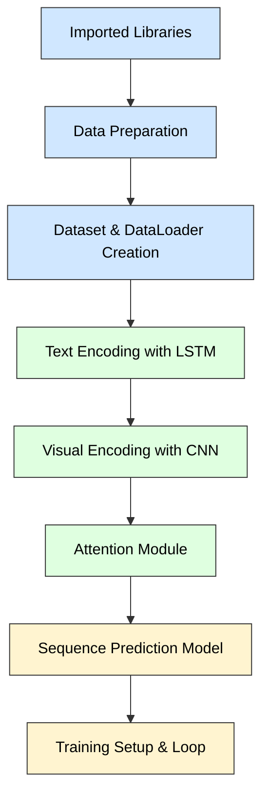

# dnnls\_final\_project


This project is my final assessment for my Deep learning course at Sheffield Hallam University.


# Multimodal Sequence Modelling


This project focuses on multimodal sequence prediction and the improvements I have chosen to make are Text encoder and Visual encoder. The goal is for the model to predict the next step in a sequence of the visual and textual inputs used.


* **Task:** Image + Text → Next Step Prediction
* **Dataset:** StoryReasoning - Oliveira, D. A. P., \& Matos, D. M. (2025). StoryReasoning Dataset: Using Chain-of-Thought for Scene Understanding and Grounded Story Generation. arXiv preprint arXiv:2505.10292. https://arxiv.org/abs/2505.10292 
* **Objective:** Improve a baseline model using enhanced encoders ans optimized training parameters.


## Baseline Architecture

The baseline model consists of the following components:

* Imported Libraries
* Data preparation
* Creating the dataset and dataset loaders
* Text encoder : LSTM
* Visual encoder: CNN
* Attention Module
* Sequence predictor model
* Training, initialization and training loop


## Baseline Setup and Minor Modifications

I made some initial changes without changing the architecture :


#### I changed the drive access to local


```python
def save_checkpoint(model, optimizer, epoch, loss, filename="autoencoder_checkpoint.pth"):
    """
    Saves the checkpoint to a local folder.
    """
    # Local folder 
    local_folder = './checkpoints'

    # Ensure the directory exists
    os.makedirs(local_folder, exist_ok=True)

    # Full file path
    full_path = os.path.join(local_folder, filename)
```


#### Evaluation Pipeline and Visualization tools
- BLEU score computation, prediction saving, score computation, loss tracking, loss curve plot, BLEU socre bar chart and prediction examples
```python
from nltk.translate.bleu_score import sentence_bleu
import json
import pandas as pd

def evaluate_model(model, dataloader):
    model.eval()
    total_loss = 0
    bleu_scores = []

    with torch.no_grad():
        for (frames, descriptions, image_target, text_target,
             roi1, roi2, roi_valid, roi_frame, ent_id) in dataloader:

            frames = frames.to(device)
            descriptions = descriptions.to(device)
            text_target = text_target.to(device)

            _, _, predicted_text_logits_k, _, _, _, _ = model(frames, descriptions, text_target)

            # Loss
            prediction_flat = predicted_text_logits_k.reshape(-1, tokenizer.vocab_size)
            target_labels = text_target.squeeze(1)[:, 1:]
            target_flat = target_labels.reshape(-1)

            loss = criterion_text(prediction_flat, target_flat)
            total_loss += loss.item()

            # BLEU
            preds = torch.argmax(predicted_text_logits_k, dim=-1)

            for pred, tgt in zip(preds, target_labels):
                pred_text = tokenizer.decode(pred, skip_special_tokens=True)
                tgt_text = tokenizer.decode(tgt, skip_special_tokens=True)

                bleu = sentence_bleu([tgt_text.split()], pred_text.split())
                bleu_scores.append(bleu)

    return {
        "text_loss": total_loss / len(dataloader),
        "bleu": sum(bleu_scores) / len(bleu_scores)
    }


# Save predictions
def save_predictions(model, dataloader, num_samples=5):
    model.eval()
    samples = []

    with torch.no_grad():
        for (frames, descriptions, image_target, text_target,
             roi1, roi2, roi_valid, roi_frame, ent_id) in dataloader:

            frames = frames.to(device)
            descriptions = descriptions.to(device)
            text_target = text_target.to(device)

            _, _, predicted_text_logits_k, _, _, _, _ = model(frames, descriptions, text_target)

            preds = torch.argmax(predicted_text_logits_k, dim=-1)

            for i in range(len(preds)):
                pred_text = tokenizer.decode(preds[i], skip_special_tokens=True)
                tgt_text = tokenizer.decode(text_target.squeeze(1)[i][1:], skip_special_tokens=True)

                samples.append({
                    "ground_truth": tgt_text,
                    "prediction": pred_text
                })

                if len(samples) >= num_samples:
                    return samples


# Plot loss
def plot_loss_curve(losses):
    plt.figure()
    plt.plot(losses)
    plt.xlabel("Epoch")
    plt.ylabel("Loss")
    plt.title("Baseline Training Loss")
    plt.savefig("baseline_loss_curve.png")
    plt.close()


# BLEU bar chart
def plot_bleu(bleu_score):
    plt.figure()
    plt.bar(["Baseline"], [bleu_score])
    plt.ylabel("BLEU Score")
    plt.title("Baseline BLEU")
    plt.savefig("baseline_bleu.png")
    plt.close()

# Figure 3
def save_prediction_examples(model, dataloader, n_samples=5):
    model.eval()
    examples = []
    
    with torch.no_grad():
        for i, batch in enumerate(dataloader):
            if i >= n_samples:
                break

            frames, descriptions, image_target, text_target, *_ = batch
            frames = frames.to(device)
            descriptions = descriptions.to(device)
            image_target = image_target.to(device)
            text_target = text_target.to(device)

            pred_image, _, pred_text_logits, *_ = model(frames, descriptions, text_target)
            pred_text_tokens = pred_text_logits.argmax(dim=-1)

            gt_text = tokenizer.decode(text_target.squeeze(1)[0][1:], skip_special_tokens=True)
            pred_text = tokenizer.decode(pred_text_tokens[0], skip_special_tokens=True)

            examples.append({
                "input_frames": frames[0].cpu().tolist(),
                "ground_truth_image": image_target[0].cpu().tolist(),
                "predicted_image": pred_image[0].cpu().tolist(),
                "ground_truth_text": gt_text,
                "predicted_text": pred_text
            })

    return examples   
```
- Attention heatmap Visualization
```python
def plot_attention_heatmaps(model, dataloader, device, n_samples=3):
    """
    - Shows n_samples individual attention maps (one per batch sample)
    - Shows an averaged attention map across batch for general trends
    """
    model.eval()
    sample_count = 0
    all_attn_maps = []

    with torch.no_grad():
        for batch in dataloader:
            if sample_count >= n_samples:
                break

            # Unpack batch 
            frames, descriptions, image_target, text_target, *_ = batch
            frames, descriptions = frames.to(device), descriptions.to(device)

            # Forward pass
            _, _, _, attn_weights, *_ = model(frames, descriptions, text_target)
            # attn_weights shape: [batch, decoder_seq_len, encoder_seq_len]

            batch_size = attn_weights.size(0)

            # Plot individual attention maps ---
            for b in range(batch_size):
                if sample_count >= n_samples:
                    break
                attn_map = attn_weights[b].detach().cpu().numpy()  # [decoder_seq_len, encoder_seq_len]

                plt.figure(figsize=(6,5))
                plt.imshow(attn_map, cmap='viridis', aspect='auto')
                plt.title(f"Attention Heatmap - Sample {sample_count}")
                plt.xlabel("Input tokens/frames")
                plt.ylabel("Output tokens/frames")
                plt.colorbar()
                plt.show()

                sample_count += 1

            # Collect for average heatmap
            all_attn_maps.append(attn_weights)

    #Plot averaged attention map
    if all_attn_maps:
        all_attn_tensor = torch.cat(all_attn_maps, dim=0)  # [total_samples, decoder_seq_len, encoder_seq_len]
        avg_attn = all_attn_tensor.mean(dim=0)  # average over all samples
        avg_attn_map = avg_attn.detach().cpu().numpy()

        plt.figure(figsize=(6,5))
        plt.imshow(avg_attn_map, cmap='viridis', aspect='auto')
        plt.title(f"Average Attention Map over {len(all_attn_tensor)} Samples")
        plt.xlabel("Input tokens/frames")
        plt.ylabel("Output tokens/frames")
        plt.colorbar()
        plt.show()
```

- Actual Figures, table and Visualization
```python
def show_full_example(example):
    frames = np.array(example["input_frames"])
    gt_img = np.array(example["ground_truth_image"])
    pred_img = np.array(example["predicted_image"])

    fig, axes = plt.subplots(2, 4, figsize=(12,6))
```
#### Model Inspection
- model summary using `torchinfo`
```python
from torchinfo import summary


max_seq_len = 200
batch_size = 4

dummy_input = torch.randint(0, tokenizer.vocab_size, (batch_size, max_seq_len)).to(device)

print("===== LSTM Text Autoencoder Summary =====")
summary(
    text_autoencoder, 
    input_data=(dummy_input, dummy_input),  # input_seq and target_seq
    col_names=["input_size", "output_size", "num_params", "trainable"],
    depth=3
)
```
```python
# 3-channel RGB image, 64x64 resolution
dummy_image = torch.randn(batch_size, 3, 64, 64).to(device)

print("===== CNN Visual Autoencoder Summary =====")
summary(
    visual_autoencoder,
    input_data=dummy_image,
    col_names=["input_size", "output_size", "num_params", "trainable"],
    depth=3
)
```
### Baseline Text encoder
- We aim to improve this text encoder model as taken from model summary, it shows the architecture and parameter distribution of the text autoencoder. From the below summary the text autoencoder was built with a `Seq2Seq` LSTM architecutr designed for capturing sequential structure and the context of the tokenized text data.

### LSTM Text Autoencoder Summary

```text
===== LSTM Text Autoencoder Summary =====

============================================================================================================================================
Layer (type:depth-idx)                   Input Shape               Output Shape              Param #                   Trainable
============================================================================================================================================
Seq2SeqLSTM                              [4, 200]                  [4, 199, 30522]           --                        False
├─EncoderLSTM: 1-1                       [4, 200]                  [4, 200, 16]              --                        False
│    └─Embedding: 2-1                    [4, 200]                  [4, 200, 16]              (488,352)                 False
│    └─LSTM: 2-2                         [4, 200, 16]              [4, 200, 16]              (2,176)                   False
├─DecoderLSTM: 1-2                       [4, 199]                  [4, 199, 30522]           --                        False
│    └─Embedding: 2-3                    [4, 199]                  [4, 199, 16]              (488,352)                 False
│    └─LSTM: 2-4                         [4, 199, 16]              [4, 199, 16]              (2,176)                   False
│    └─Linear: 2-5                       [4, 199, 16]              [4, 199, 30522]           (518,874)                 False
============================================================================================================================================
Total params: 1,499,930
Trainable params: 0
Non-trainable params: 1,499,930
Total mult-adds (Units.MEGABYTES): 9.46
============================================================================================================================================
Input size (MB): 0.01
Forward/backward pass size (MB): 194.77
Params size (MB): 6.00
Estimated Total Size (MB): 200.79
============================================================================================================================================
```
### Baseline Visual encoder
- We aim to improve this visual encoder model as taken from model summary, it shows the architecture and parameter distribution of the visual autoencoder. The below CNN autoencoder uses an encoder-decoder structure to learn spatial hierachies and reconstruction of images from latent features. It is built to improve reconstruction quality over time.
### CNN Visual Autoencoder Summary


```text
===== CNN Visual Autoencoder Summary =====

============================================================================================================================================
Layer (type:depth-idx)                   Input Shape               Output Shape              Param #                   Trainable
============================================================================================================================================
VisualAutoencoder                        [4, 3, 64, 64]            [2, 3, 60, 125]           --                        True
├─VisualEncoder: 1-1                     [4, 3, 64, 64]            [2, 16]                   --                        True
│    └─Backbone: 2-1                     [4, 3, 64, 64]            [2, 16]                   --                        True
│    │    └─Sequential: 3-1              [4, 3, 64, 64]            [4, 64, 8, 8]             33,920                    True
│    │    └─Sequential: 3-2              [2, 8192]                 [2, 16]                   131,088                   True
│    └─Backbone: 2-2                     [4, 3, 64, 64]            [2, 16]                   --                        True
│    │    └─Sequential: 3-3              [4, 3, 64, 64]            [4, 64, 8, 8]             33,920                    True
│    │    └─Sequential: 3-4              [2, 8192]                 [2, 16]                   131,088                   True
│    └─Linear: 2-3                       [2, 32]                   [2, 16]                   528                       True
├─VisualDecoder: 1-2                     [2, 16]                   [2, 3, 60, 125]           --                        True
│    └─Linear: 2-4                       [2, 16]                   [2, 8192]                 139,264                   True
│    └─Sequential: 2-5                   [2, 64, 8, 16]            [2, 3, 64, 128]           --                        True
│    │    └─ConvTranspose2d: 3-5         [2, 64, 8, 16]            [2, 32, 16, 32]           18,464                    True
│    │    └─GroupNorm: 3-6               [2, 32, 16, 32]           [2, 32, 16, 32]           64                        True
│    │    └─LeakyReLU: 3-7               [2, 32, 16, 32]           [2, 32, 16, 32]           --                        --
│    │    └─ConvTranspose2d: 3-8         [2, 32, 16, 32]           [2, 16, 32, 64]           12,816                    True
│    │    └─GroupNorm: 3-9               [2, 16, 32, 64]           [2, 16, 32, 64]           32                        True
│    │    └─LeakyReLU: 3-10              [2, 16, 32, 64]           [2, 16, 32, 64]           --                        --
│    │    └─ConvTranspose2d: 3-11        [2, 16, 32, 64]           [2, 3, 64, 128]           2,355                     True
│    │    └─Sigmoid: 3-12                [2, 3, 64, 128]           [2, 3, 64, 128]           --                        --
│    └─Sequential: 2-6                   [2, 64, 8, 16]            [2, 3, 64, 128]           (recursive)               True
│    │    └─ConvTranspose2d: 3-13        [2, 64, 8, 16]            [2, 32, 16, 32]           (recursive)               True
│    │    └─GroupNorm: 3-14              [2, 32, 16, 32]           [2, 32, 16, 32]           (recursive)               True
│    │    └─LeakyReLU: 3-15              [2, 32, 16, 32]           [2, 32, 16, 32]           --                        --
│    │    └─ConvTranspose2d: 3-16        [2, 32, 16, 32]           [2, 16, 32, 64]           (recursive)               True
│    │    └─GroupNorm: 3-17              [2, 16, 32, 64]           [2, 16, 32, 64]           (recursive)               True
│    │    └─LeakyReLU: 3-18              [2, 16, 32, 64]           [2, 16, 32, 64]           --                        --
│    │    └─ConvTranspose2d: 3-19        [2, 16, 32, 64]           [2, 3, 64, 128]           (recursive)               True
│    │    └─Sigmoid: 3-20                [2, 3, 64, 128]           [2, 3, 64, 128]           --                        --
============================================================================================================================================
Total params: 503,539
Trainable params: 503,539
Non-trainable params: 0
Total mult-adds (Units.MEGABYTES): 275.93
============================================================================================================================================
Input size (MB): 0.20
Forward/backward pass size (MB): 7.73
Params size (MB): 2.01
Estimated Total Size (MB): 9.94
============================================================================================================================================
```

### Baseline Results
