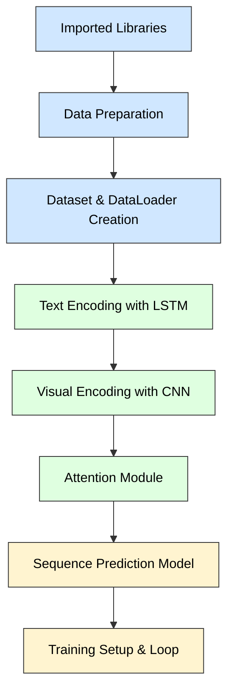
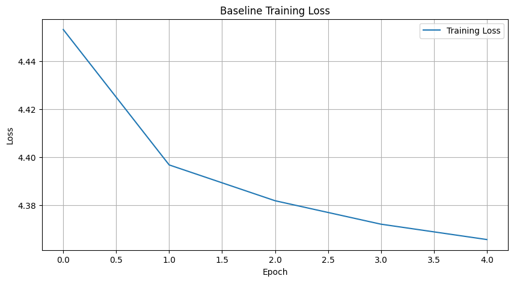
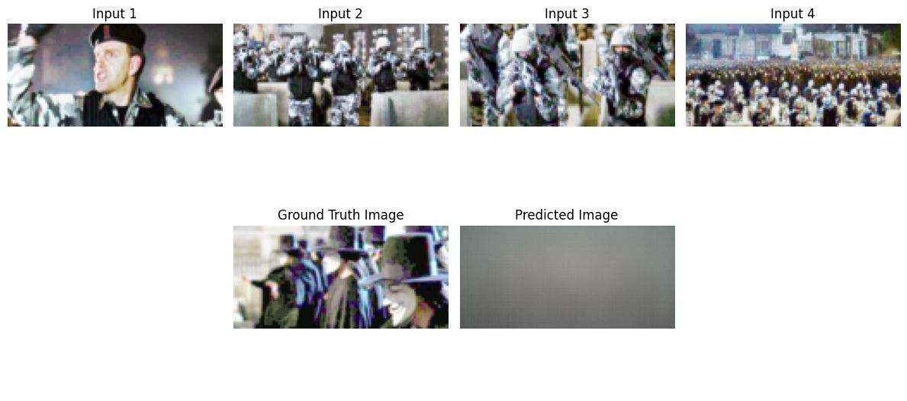
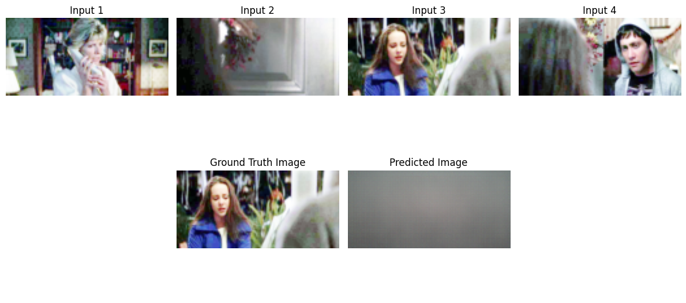

# dnnls\_final\_project


This project is my final assessment for my Deep learning course at Sheffield Hallam University.


# Multimodal Sequence Modelling


This project focuses on multimodal sequence prediction and the improvements I have chosen to make are Text encoder and Visual encoder. The goal is for the model to predict the next step in a sequence of the visual and textual inputs used.


* **Task:** Image + Text → Next Step Prediction
* **Dataset:** StoryReasoning - Oliveira, D. A. P., \& Matos, D. M. (2025). StoryReasoning Dataset: Using Chain-of-Thought for Scene Understanding and Grounded Story Generation. arXiv preprint arXiv:2505.10292. https://arxiv.org/abs/2505.10292 
* **Objective:** Improve a baseline model using enhanced encoders ans optimized training parameters.


## Baseline Architecture

The baseline model consists of the following components:

* Imported Libraries
* Data preparation
* Creating the dataset and dataset loaders
* Text encoder : LSTM
* Visual encoder: CNN
* Attention Module
* Sequence predictor model
* Training, initialization and training loop


## Baseline Setup and Minor Modifications

I made some initial changes without changing the architecture :


#### Evaluation Pipeline and Visualization tools
- Prediction saving, BLEU/ROUGE/METEOR score computation, SSIM and PSNR evaluation, text and image loss tracking, metric visualization plots (loss curves, BLEU/ROUGE/METEOR/SSIM/PSNR score bar charts) and prediction examples.
```python
# Project Evaluation
# Initialize metrics from HuggingFace evaluate
rouge_metric = evaluate.load('rouge')
meteor_metric = evaluate.load('meteor')

def evaluate_model(model, dataloader):
    model.eval()
    total_text_loss = 0
    total_image_loss = 0

    all_preds_text = []
    all_gts_text = []
    bleu_scores = []
    ssim_scores = []
    psnr_scores = []
    mse_scores = []

    with torch.no_grad():
        for batch in dataloader:
            # Adjusting unpacking to match requested structure
            # Note: The existing dataloader returns 9 items, mapping them accordingly
            frames, image_target, roi1, roi2, roi_valid, roi_frame, ent_id, text_dict, obj_labels = batch

            # Mapping to user names
            descriptions = text_dict["input_ids"].to(device)
            text_target = text_dict["target_ids"].to(device)
            frames = frames.to(device)
            image_target = image_target.to(device)

            # Forward pass: Capturing all 8 return values from SequencePredictor
            # but using the 3 arguments requested by user
            pred_image, _, predicted_text_logits_k, _, _, _, _, attn_weights = model(
                frames,
                descriptions,
                text_dict["attention_mask"].to(device),
                text_dict["decoder_input_ids"].to(device)
            )

            # Image Metrics
            img_loss = F.mse_loss(pred_image, image_target)
            total_image_loss += img_loss.item()

            for i in range(image_target.size(0)):
                gt_np = image_target[i].cpu().permute(1, 2, 0).numpy()
                pred_np = pred_image[i].cpu().permute(1, 2, 0).numpy()

                # SSIM
                s = ssim(gt_np, pred_np, data_range=1.0, channel_axis=2)
                ssim_scores.append(s)

                # MSE
                m = np.mean((gt_np - pred_np) ** 2)
                mse_scores.append(m)

                # PSNR
                p = psnr(gt_np, pred_np, data_range=1.0)
                psnr_scores.append(p)

            # Text Metrics
            prediction_flat = predicted_text_logits_k.reshape(-1, tokenizer.vocab_size)
            target_flat = text_target.reshape(-1)
            loss_text = criterion_text(prediction_flat, target_flat)
            total_text_loss += loss_text.item()

            preds = torch.argmax(predicted_text_logits_k, dim=-1)
            for pred, tgt in zip(preds, text_target):
                pred_text = tokenizer.decode(pred, skip_special_tokens=True)
                tgt_text = tokenizer.decode(tgt, skip_special_tokens=True)

                all_preds_text.append(pred_text)
                all_gts_text.append(tgt_text)

                # BLEU
                bleu = sentence_bleu([tgt_text.split()], pred_text.split())
                bleu_scores.append(bleu)

    # Batch-level text metrics
    rouge_results = rouge_metric.compute(predictions=all_preds_text, references=all_gts_text)
    meteor_results = meteor_metric.compute(predictions=all_preds_text, references=all_gts_text)

    return {
        "text_loss": total_text_loss / len(dataloader),
        "image_reconstruction_loss": total_image_loss / len(dataloader),
        "bleu": sum(bleu_scores) / len(bleu_scores),
        "rougeL": rouge_results['rougeL'],
        "meteor": meteor_results['meteor'],
        "ssim": sum(ssim_scores) / len(ssim_scores),
        "mse": sum(mse_scores) / len(mse_scores),
        "psnr": sum(psnr_scores) / len(psnr_scores)
    }

```
- Attention heatmap Visualization
```python
def plot_attention_heatmaps(model, dataloader, device, n_samples=3):
    """
    - Shows n_samples individual attention maps (one per batch sample)
    - Shows an averaged attention map across batch for general trends
    """
    model.eval()
    sample_count = 0
    all_attn_maps = []

    with torch.no_grad():
        for batch in dataloader:
            if sample_count >= n_samples:
                break

            # Unpack batch 
            frames, descriptions, image_target, text_target, *_ = batch
            frames, descriptions = frames.to(device), descriptions.to(device)

            # Forward pass
            _, _, _, attn_weights, *_ = model(frames, descriptions, text_target)
            # attn_weights shape: [batch, decoder_seq_len, encoder_seq_len]

            batch_size = attn_weights.size(0)

            # Plot individual attention maps ---
            for b in range(batch_size):
                if sample_count >= n_samples:
                    break
                attn_map = attn_weights[b].detach().cpu().numpy()  # [decoder_seq_len, encoder_seq_len]

                plt.figure(figsize=(6,5))
                plt.imshow(attn_map, cmap='viridis', aspect='auto')
                plt.title(f"Attention Heatmap - Sample {sample_count}")
                plt.xlabel("Input tokens/frames")
                plt.ylabel("Output tokens/frames")
                plt.colorbar()
                plt.show()

                sample_count += 1

            # Collect for average heatmap
            all_attn_maps.append(attn_weights)

    #Plot averaged attention map
    if all_attn_maps:
        all_attn_tensor = torch.cat(all_attn_maps, dim=0)  # [total_samples, decoder_seq_len, encoder_seq_len]
        avg_attn = all_attn_tensor.mean(dim=0)  # average over all samples
        avg_attn_map = avg_attn.detach().cpu().numpy()

        plt.figure(figsize=(6,5))
        plt.imshow(avg_attn_map, cmap='viridis', aspect='auto')
        plt.title(f"Average Attention Map over {len(all_attn_tensor)} Samples")
        plt.xlabel("Input tokens/frames")
        plt.ylabel("Output tokens/frames")
        plt.colorbar()
        plt.show(def plot_attention_heatmaps(model, dataloader, device, n_samples=3):
    model.eval()
    all_attn_maps = []
    sample_idx = 0

    with torch.no_grad():
        for batch in dataloader:
            if sample_idx >= n_samples: break
            frames, image_target, roi1, roi2, roi_valid, roi_frame, ent_id, text_dict, obj_labels = batch

            # Capturing attention weights (8th return value)
            _, _, _, _, _, _, _, attn_weights = model(
                frames.to(device),
                text_dict["input_ids"].to(device),
                text_dict["attention_mask"].to(device),
                text_dict["decoder_input_ids"].to(device)
            )

            for b in range(attn_weights.size(0)):
                if sample_idx >= n_samples: break
                # Reshape for the 4 input frames visualization
                attn_map = attn_weights[b].detach().cpu().numpy().reshape(1, -1)
                plt.figure(figsize=(6, 2))
                img = plt.imshow(attn_map, cmap='viridis', aspect='auto')
                plt.title(f"Attention Map Sample {sample_idx+1}\n(Importance over 4 input frames)")
                plt.xlabel("Input Frame Index (0-3)")
                plt.ylabel("Attention Value")
                cbar = plt.colorbar(img)
                cbar.set_label('Attention Weight')
                plt.show()
                all_attn_maps.append(attn_weights[b])
                sample_idx += 1

    if all_attn_maps:
        avg_attn = torch.stack(all_attn_maps).mean(dim=0).cpu().numpy().reshape(1, -1)
        plt.figure(figsize=(6, 2))
        img = plt.imshow(avg_attn, cmap='viridis', aspect='auto')
        plt.title(f"Average Attention Map ({n_samples} samples)\n(Mean importance over 4 input frames)")
        plt.xlabel("Input Frame Index (0-3)")
        plt.ylabel("Attention Value")
        cbar = plt.colorbar(img)
        cbar.set_label('Attention Weight')
        plt.show()
)
```

- Actual Figures, table and Visualization
```python
def show_full_example(example):
    frames = np.array(example["input_frames"])
    gt_img = np.array(example["ground_truth_image"])
    pred_img = np.array(example["predicted_image"])

    fig, axes = plt.subplots(2, 4, figsize=(12,6))
```
#### Model Inspection
- model summary using `torchinfo`
```python
from torchinfo import summary


max_seq_len = 200
batch_size = 4

dummy_input = torch.randint(0, tokenizer.vocab_size, (batch_size, max_seq_len)).to(device)

print("===== LSTM Text Autoencoder Summary =====")
summary(
    text_autoencoder, 
    input_data=(dummy_input, dummy_input),  # input_seq and target_seq
    col_names=["input_size", "output_size", "num_params", "trainable"],
    depth=3
)
```
```python
# 3-channel RGB image, 64x64 resolution
dummy_image = torch.randn(batch_size, 3, 64, 64).to(device)

print("===== CNN Visual Autoencoder Summary =====")
summary(
    visual_autoencoder,
    input_data=dummy_image,
    col_names=["input_size", "output_size", "num_params", "trainable"],
    depth=3
)
```
### Baseline Text encoder
- We aim to improve this text encoder model as taken from model summary, it shows the architecture and parameter distribution of the text autoencoder. From the below summary the text autoencoder was built with a `Seq2Seq` LSTM architecutr designed for capturing sequential structure and the context of the tokenized text data.

### LSTM Text Autoencoder Summary

```text
===== LSTM Text Autoencoder Summary =====

============================================================================================================================================
Layer (type:depth-idx)                   Input Shape               Output Shape              Param #                   Trainable
============================================================================================================================================
Seq2SeqLSTM                              [4, 200]                  [4, 199, 30522]           --                        False
├─EncoderLSTM: 1-1                       [4, 200]                  [4, 200, 16]              --                        False
│    └─Embedding: 2-1                    [4, 200]                  [4, 200, 16]              (488,352)                 False
│    └─LSTM: 2-2                         [4, 200, 16]              [4, 200, 16]              (2,176)                   False
├─DecoderLSTM: 1-2                       [4, 199]                  [4, 199, 30522]           --                        False
│    └─Embedding: 2-3                    [4, 199]                  [4, 199, 16]              (488,352)                 False
│    └─LSTM: 2-4                         [4, 199, 16]              [4, 199, 16]              (2,176)                   False
│    └─Linear: 2-5                       [4, 199, 16]              [4, 199, 30522]           (518,874)                 False
============================================================================================================================================
Total params: 1,499,930
Trainable params: 0
Non-trainable params: 1,499,930
Total mult-adds (Units.MEGABYTES): 9.46
============================================================================================================================================
Input size (MB): 0.01
Forward/backward pass size (MB): 194.77
Params size (MB): 6.00
Estimated Total Size (MB): 200.79
============================================================================================================================================
```
### Baseline Visual encoder
- We aim to improve this visual encoder model as taken from model summary, it shows the architecture and parameter distribution of the visual autoencoder. The below CNN autoencoder uses an encoder-decoder structure to learn spatial hierachies and reconstruction of images from latent features. It is built to improve reconstruction quality over time.
### CNN Visual Autoencoder Summary


```text
===== CNN Visual Autoencoder Summary =====

============================================================================================================================================
Layer (type:depth-idx)                   Input Shape               Output Shape              Param #                   Trainable
============================================================================================================================================
VisualAutoencoder                        [4, 3, 64, 64]            [2, 3, 60, 125]           --                        True
├─VisualEncoder: 1-1                     [4, 3, 64, 64]            [2, 16]                   --                        True
│    └─Backbone: 2-1                     [4, 3, 64, 64]            [2, 16]                   --                        True
│    │    └─Sequential: 3-1              [4, 3, 64, 64]            [4, 64, 8, 8]             33,920                    True
│    │    └─Sequential: 3-2              [2, 8192]                 [2, 16]                   131,088                   True
│    └─Backbone: 2-2                     [4, 3, 64, 64]            [2, 16]                   --                        True
│    │    └─Sequential: 3-3              [4, 3, 64, 64]            [4, 64, 8, 8]             33,920                    True
│    │    └─Sequential: 3-4              [2, 8192]                 [2, 16]                   131,088                   True
│    └─Linear: 2-3                       [2, 32]                   [2, 16]                   528                       True
├─VisualDecoder: 1-2                     [2, 16]                   [2, 3, 60, 125]           --                        True
│    └─Linear: 2-4                       [2, 16]                   [2, 8192]                 139,264                   True
│    └─Sequential: 2-5                   [2, 64, 8, 16]            [2, 3, 64, 128]           --                        True
│    │    └─ConvTranspose2d: 3-5         [2, 64, 8, 16]            [2, 32, 16, 32]           18,464                    True
│    │    └─GroupNorm: 3-6               [2, 32, 16, 32]           [2, 32, 16, 32]           64                        True
│    │    └─LeakyReLU: 3-7               [2, 32, 16, 32]           [2, 32, 16, 32]           --                        --
│    │    └─ConvTranspose2d: 3-8         [2, 32, 16, 32]           [2, 16, 32, 64]           12,816                    True
│    │    └─GroupNorm: 3-9               [2, 16, 32, 64]           [2, 16, 32, 64]           32                        True
│    │    └─LeakyReLU: 3-10              [2, 16, 32, 64]           [2, 16, 32, 64]           --                        --
│    │    └─ConvTranspose2d: 3-11        [2, 16, 32, 64]           [2, 3, 64, 128]           2,355                     True
│    │    └─Sigmoid: 3-12                [2, 3, 64, 128]           [2, 3, 64, 128]           --                        --
│    └─Sequential: 2-6                   [2, 64, 8, 16]            [2, 3, 64, 128]           (recursive)               True
│    │    └─ConvTranspose2d: 3-13        [2, 64, 8, 16]            [2, 32, 16, 32]           (recursive)               True
│    │    └─GroupNorm: 3-14              [2, 32, 16, 32]           [2, 32, 16, 32]           (recursive)               True
│    │    └─LeakyReLU: 3-15              [2, 32, 16, 32]           [2, 32, 16, 32]           --                        --
│    │    └─ConvTranspose2d: 3-16        [2, 32, 16, 32]           [2, 16, 32, 64]           (recursive)               True
│    │    └─GroupNorm: 3-17              [2, 16, 32, 64]           [2, 16, 32, 64]           (recursive)               True
│    │    └─LeakyReLU: 3-18              [2, 16, 32, 64]           [2, 16, 32, 64]           --                        --
│    │    └─ConvTranspose2d: 3-19        [2, 16, 32, 64]           [2, 3, 64, 128]           (recursive)               True
│    │    └─Sigmoid: 3-20                [2, 3, 64, 128]           [2, 3, 64, 128]           --                        --
============================================================================================================================================
Total params: 503,539
Trainable params: 503,539
Non-trainable params: 0
Total mult-adds (Units.MEGABYTES): 275.93
============================================================================================================================================
Input size (MB): 0.20
Forward/backward pass size (MB): 7.73
Params size (MB): 2.01
Estimated Total Size (MB): 9.94
============================================================================================================================================
```

### Baseline Results

| Model    | Text Loss | Image Loss | BLEU    | METEOR | SSIM   | PSNR    | Number of Epochs | Learning Rate | Batch Size | Embedding Dim | Latent Dim | Num Layers |
|----------|-----------|-------------|---------|---------|--------|---------|------------------|---------------|------------|---------------|------------|------------|
| Baseline | 4.1015    | 0.2414      | 0.0148  | 0.2432  | 0.1279 | 11.0754 | 5                | 0.001         | 4          | 16            | 16         | 1          |
### Figure

#### Training Loss
This is a graph of the loss of the baseline model against the the epoch.


#### Baseline Metric Score
This is a chart displaying the Baseline Metrics  Score


#### Example 



Ground Truth:
 the confrontation continued as anon leader stood among the soldiers. the air was thick with tension, and they tried to decipher the meaning behind the masked figure. anon leader spoke again, “ we are not your enemies. we are the voice of the people. ” the soldiers remained silent, unsure of how to respond.

Prediction:
 the tension was the the air of, in the tension, the room was a with a, and the was to the beher the tension. the tension of. the air of, with, and he need to was mind, the need to weight, the room, the he room ' a, and of the to the. in lighting lighting lighting lighting lighting lightinglllllllllllllllllllllllrkedrkedrkedrkedrkedrkedrkedrkedrkedrkedrkedrkedrkedrkedrkedrkedrkedrkedrkedrkedrkedrked



Ground Truth:
 back outside, sarah addressed tom with a sense of urgency. " we need to find her, " she insisted. tom nodded in agreement, his mind racing with possibilities. the potted plant stood as a silent witness to the tension between her and him. the indoor setting felt like a cage, trapping them in their fear.

Prediction:
 the in, the, the, the silent of tension, the we need to the a, but he was. the,, the, and mind racing with the. the roomted plant, near he man witness to the tension. the. the. the room room was a a sense, but him. the shoulders. the on lighting lighting lighting lighting lighting lightinglllllllllllllllllllllllllllllllllrkedrkedrkedrkedrkedrkedrkedrkedrkedrkedrkedrkedrked

#### Attention Heatmap

This is the average attention heatmap over 3 examples


### Summary of Baseline Model Evaluation

The baseline model which consists of an LSTM-based text encoder which had a pretrained auto_encoder.pth used and CNN-based image encoder which then achieved a text loss of **4.1015** and an image loss of **0.2414** after 5 training epochs( the auto_encoder.pth was already trained on 15 epochs). Evaluation was performed using both natural language generation metrics and image reconstruction quality metrics in order to assess the model’s multimodal learning capability.

The model achieved a **BLEU score of 0.0148** which indicated it had a very low n-gram overlap between generated text and the ground truth captions. This suggests that the model struggled to generate syntactically and semantically accurate sequences( this can be seen in the image in the example). Similarly the **METEOR score of 0.2432** which although is slightly better due to its use of synonym and recall-based matching which still reflects weak overall language generation performance.

For image quality evaluation the model obtained an **SSIM score of 0.1279** which indicated poor structural similarity between generated and target image representations. The **PSNR score of 11.0754 dB** also suggests low image reconstruction quality with significant noise and distortion present in the generated outputs. PSNR is mathematically derived from Mean Squared Error (MSE) where lower MSE values correspond to higher PSNR values. Therefore, PSNR was used as a more interpretable representation of reconstruction fidelity instead of reporting MSE separately.

The generated text examples further demonstrate the limitations of the baseline model. While the model occasionally captured isolated contextual words such as *tension*, *room*, and *mind racing*, the generated sentences quickly deteriorated into repetitive and incoherent outputs containing duplicated words and corrupted token sequences. This behaviour indicates difficulties in long-range sequence modelling, semantic consistency, and stable decoding.

The attention heatmap visualization also reveals limitations in the baseline attention mechanism. Rather than producing interpretable frame-level temporal attention distributions, the baseline model generated a broader 64-dimensional attention representation with noisy activation patterns and several dominant peaks across latent dimensions. This suggests that the model was learning feature-level activation emphasis rather than meaningful temporal attention across the four input frames. The presence of unstable and highly varied activations indicates weak multimodal alignment and limited interpretability of the learned attention behaviour.

Overall, the baseline model demonstrates limited capability in both textual generation and image representation learning. The low BLEU, SSIM and PSNR scores combined with incoherent predictions and noisy attention distributions has highlighted the need for architectural improvements to better capture multimodal relationships in the story reasoning dataset and temporal dependencies, and semantic consistency.


