# dnnls\_final\_project


This project is my final assessment for my Deep learning course at Sheffield Hallam University.


# MULTIMODAL SEQUENCE PREDICTION USING CLIP, RPBERTA AND GRU ATTENTION

## Quick links
- **[Experiment Notebook](Experiment_Roberta+CLIP_FINAL.ipynb)** - Full Notebook experiment
- **[Main Notebook Experiment Result](Experiment/Roberta_CLIP_FINAL_Experiment)** Notebook result
- **[Result Comparison](Result)** Result comparing the main notebook and baseline

This project focuses on multimodal sequence prediction and the improvements I have chosen to make are Text encoder and Visual encoder. The goal is for the model to predict the next step in a sequence of the visual and textual inputs used.

## Innovative Summary
I upgraded the baseline multimodal pipeline by replacing the LSTM encoder with RoBERTa and deepening the decoder to two layers then adding MLP, weighting, and I replaced the CNN encoder with CLIP-based visual encoding with skip-fused progressive upsampling.
These changes produced the strongest overall results so far with major gains in text coherence, temporal attention balance, and semi structural image reconstruction.

## Key Results
| Model | Baseline | LSTM+CLIP | Roberta+CNN | Roberta+CLIP | Roberta+CLIP FIN | Roberta+CLIP FIN 2 | Roberta+CLIP FIN 3 | Roberta+CLIP FINAL | Change of Final Vs Baseline % |
|---|---:|---:|---:|---:|---:|---:|---:|---:|---:|
| Text_Loss | 4.101497 | 4.173895611 | 5.3021316 | 4.509542 | 5.803475 | 4.284719 | 3.9161891 | 3.085878801 | -24.76% |
| Image_Loss | 0.241354 | 0.078963423 | 0.0789524 | 0.078987 | 0.080963 | 0.078944 | 0.0789126 | 0.079319471 | -67.14% |
| BLEU | 0.014809 | 0.011708803 | 0.0071759 | 0.020288 | 8.62E-156 | 0.032196 | 0.0816064 | 0.149424893 | 909.04% |
| ROUGE-L | 0.274862 | 0.274862192 | 0.2048801 | 0.282272 | 0.2072694 | 0.283405 | 0.3748817 | 0.409114987 | 48.84% |
| METEOR | 0.243241 | 0.244985779 | 0.1544091 | 0.226247 | 0.119653 | 0.245391 | 0.333105 | 0.462147619 | 90.00% |
| SSIM | 0.12794 | 0.12276778 | 0.1283504 | 0.127795 | 0.0911122 | 0.125379 | 0.1282861 | 0.23048213 | 80.15% |
| PSNR | 11.07541 | 11.07707989 | 11.076756 | 11.07765 | 10.963097 | 11.08315 | 11.08333 | 11.0754061 | 0.00% |
## Most Important Findiing
The pretraining of the text autoencoder for 80+ epochs along with weight tying and MLP projection head massively improved the text quality with BLEU alone reaching 909% [visualization](Result/Final_model_vs_Baseline.png)

## How to Reproduce
1. 'pip install -r requirements.txt'
2. open 'Experiment_Roberta+CLIP_FINAL.ipynb'
3.  run cells


* **Task:** Image + Text → Next Step Prediction
* **Dataset:** StoryReasoning - Oliveira, D. A. P., \& Matos, D. M. (2025). StoryReasoning Dataset: Using Chain-of-Thought for Scene Understanding and Grounded Story Generation. arXiv preprint arXiv:2505.10292. https://arxiv.org/abs/2505.10292 
* **Objective:** Improve a baseline model using enhanced encoders and optimized training parameters.


## Baseline Architecture

The baseline model consists of the following components:

* Imported Libraries
* Data preparation
* Creating the dataset and dataset loaders
* Text encoder : LSTM
* Visual encoder: CNN
* Attention Module
* Sequence predictor model
* Training, initialization and training loop

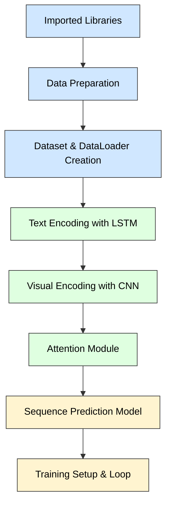
```mermaid
flowchart TD
    A["Imported Libraries"]:::lightblue
    B["Data Preparation"]:::lightblue
    C["Dataset & DataLoader Creation"]:::lightblue
    D["Text Encoding with LSTM"]:::lightgreen
    E["Visual Encoding with CNN"]:::lightgreen
    F["Attention Module"]:::lightgreen
    G["Sequence Prediction Model"]:::lightorange
    H["Training Setup & Loop"]:::lightorange

    A --> B --> C
    C --> D
    D --> E --> F
    F --> G
    G --> H

    classDef lightblue fill:#D0E7FF,stroke:#333,stroke-width:1px,color:#000
    classDef lightgreen fill:#DFFFE0,stroke:#333,stroke-width:1px,color:#000
    classDef lightorange fill:#FFF4D0,stroke:#333,stroke-width:1px,color:#000
```
## Baseline Setup and Minor Modifications

I made some initial changes without changing the architecture :


#### Evaluation Pipeline and Visualization tools
- Prediction saving, BLEU/ROUGE/METEOR score computation, SSIM and PSNR evaluation, text and image loss tracking, metric visualization plots (loss curves, BLEU/ROUGE/METEOR/SSIM/PSNR score bar charts), attention heatmaps and prediction examples.

**[Evaluation Pipeline and Visualization](src/Evaluation,Pipeline and Visualization.py)**

#### Model Inspection
- model summary using `torchinfo`
```python
from torchinfo import summary


max_seq_len = 200
batch_size = 4

dummy_input = torch.randint(0, tokenizer.vocab_size, (batch_size, max_seq_len)).to(device)

print("===== LSTM Text Autoencoder Summary =====")
summary(
    text_autoencoder, 
    input_data=(dummy_input, dummy_input),  # input_seq and target_seq
    col_names=["input_size", "output_size", "num_params", "trainable"],
    depth=3
)
```
```python
# 3-channel RGB image, 64x64 resolution
dummy_image = torch.randn(batch_size, 3, 64, 64).to(device)

print("===== CNN Visual Autoencoder Summary =====")
summary(
    visual_autoencoder,
    input_data=dummy_image,
    col_names=["input_size", "output_size", "num_params", "trainable"],
    depth=3
)
```
### Baseline Text encoder
- We aim to improve this text encoder model as taken from model summary, it shows the architecture and parameter distribution of the text autoencoder. From the below summary the text autoencoder was built with a `Seq2Seq` LSTM architecutr designed for capturing sequential structure and the context of the tokenized text data.

### Baseline Visual encoder
- We aim to improve this visual encoder model as taken from model summary, it shows the architecture and parameter distribution of the visual autoencoder. The below CNN autoencoder uses an encoder-decoder structure to learn spatial hierachies and reconstruction of images from latent features. It is built to improve reconstruction quality over time.


### Baseline Results

| Model    | Text Loss | Image Loss | BLEU    | METEOR | SSIM   | PSNR    | Number of Epochs | Learning Rate | Batch Size | Embedding Dim | Latent Dim | Num Layers |
|----------|-----------|-------------|---------|---------|--------|---------|------------------|---------------|------------|---------------|------------|------------|
| Baseline | 4.1015    | 0.2414      | 0.0148  | 0.2432  | 0.1279 | 11.0754 | 5                | 0.001         | 4          | 16            | 16         | 1          |
### Figure

#### Training Loss
This is a graph of the loss of the baseline model against the the epoch.


#### Baseline Metric Score
This is a chart displaying the Baseline Metrics  Score
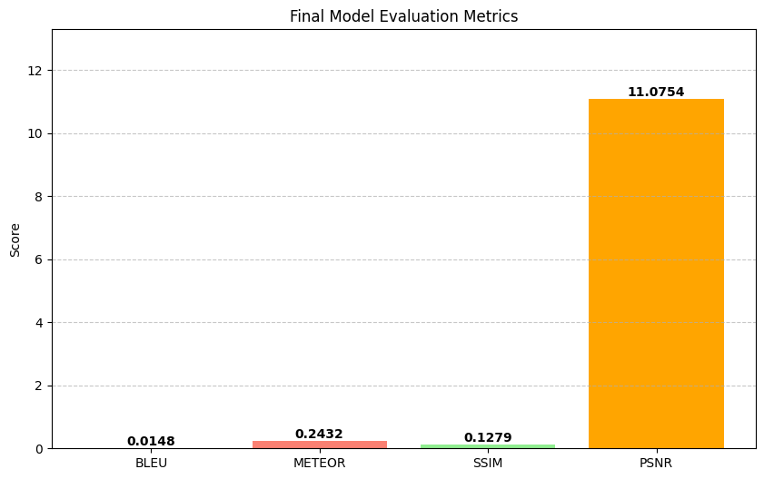

#### Example 


Ground Truth:
 the confrontation continued as anon leader stood among the soldiers. the air was thick with tension, and they tried to decipher the meaning behind the masked figure. anon leader spoke again, “ we are not your enemies. we are the voice of the people. ” the soldiers remained silent, unsure of how to respond.

Prediction:
 the tension was the the air of, in the tension, the room was a with a, and the was to the beher the tension. the tension of. the air of, with, and he need to was mind, the need to weight, the room, the he room ' a, and of the to the. in lighting lighting lighting lighting lighting lightinglllllllllllllllllllllllrkedrkedrkedrkedrkedrkedrkedrkedrkedrkedrkedrkedrkedrkedrkedrkedrkedrkedrkedrkedrkedrked


Ground Truth:
 back outside, sarah addressed tom with a sense of urgency. " we need to find her, " she insisted. tom nodded in agreement, his mind racing with possibilities. the potted plant stood as a silent witness to the tension between her and him. the indoor setting felt like a cage, trapping them in their fear.

Prediction:
 the in, the, the, the silent of tension, the we need to the a, but he was. the,, the, and mind racing with the. the roomted plant, near he man witness to the tension. the. the. the room room was a a sense, but him. the shoulders. the on lighting lighting lighting lighting lighting lightinglllllllllllllllllllllllllllllllllrkedrkedrkedrkedrkedrkedrkedrkedrkedrkedrkedrkedrked

#### Attention Heatmap

This is the average attention heatmap over 3 examples

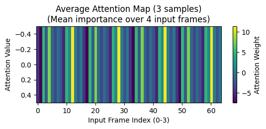

### Summary of Baseline Model Evaluation

The baseline model used an LSTM-based text encoder with a pretrained autoencoder and a CNN-based image encoder. After training, it achieved a text loss of **4.1015** and an image loss of **0.2414**.

The model showed weak performance in both text generation and image reconstruction tasks, achieving a **BLEU score of 0.0148**, **METEOR score of 0.2432**, **SSIM score of 0.1279**, and **PSNR score of 11.08 dB**. Generated captions were often repetitive and incoherent, while reconstructed images contained noticeable distortion and low structural similarity.

Attention visualizations also revealed unstable and noisy activation patterns rather than meaningful temporal attention across input frames, indicating weak multimodal alignment and limited temporal reasoning capability.

Overall, the baseline model struggled with semantic consistency, image quality, and multimodal learning, highlighting the need for improved architectures and stronger feature representations.

# LSTM + CLIP Model

In this experiment, the original CNN-based visual encoder used in the baseline model is replaced with a pretrained CLIP visual encoder. The primary goal of this modification is to improve the quality of the learned visual representations and enhance image reconstruction performance, particularly in terms of SSIM and PSNR metrics.

The baseline model utilised a lightweight custom CNN to encode image frames into latent representations. Although computationally efficient, the CNN was trained from limited data and therefore had limited capability in extracting rich semantic visual features. This was reflected in the relatively low SSIM and PSNR scores obtained during baseline evaluation.

To address this limitation, the CNN encoder was replaced with the vision component of the pretrained CLIP (Contrastive Language–Image Pretraining) model, specifically:

- `openai/clip-vit-base-patch32`

CLIP is a large-scale multimodal model developed by OpenAI and trained on millions of image-text pairs using contrastive learning. Unlike traditional CNN encoders trained solely for image classification, CLIP learns semantically meaningful visual representations that align images with natural language descriptions in a shared embedding space. This enables the model to capture higher-level contextual and semantic information from images.

In the modified architecture, the CLIP vision encoder is used as a pretrained feature extractor. Input frames are resized to `224 × 224`, normalized using CLIP preprocessing statistics, and passed through the CLIP Vision Transformer (ViT) backbone to obtain high-dimensional visual embeddings. These embeddings are then projected into the same latent dimension used by the baseline model in order to maintain compatibility with the existing LSTM decoder and multimodal fusion pipeline.

To improve training stability, a staged training strategy was also introduced. During the first **2 epochs**, the image decoder was frozen while the remaining components adapted to the pretrained CLIP representations. After this warm-up phase, the image decoder was unfrozen and jointly trained for the remaining **3 epochs**. This gradual unfreezing approach helped stabilise optimisation and allowed the decoder to better adapt to the richer semantic features extracted by CLIP.

In addition, the multimodal loss function was rebalanced to reduce text dominance during optimisation. In the baseline setup, the text generation loss contributed more strongly to the total optimisation objective, which could bias training toward textual performance at the expense of image reconstruction quality. To address this, the image reconstruction loss was given a higher weighting while the text loss contribution was reduced:

```python
# Total loss (base + optional improvements)
W_IM = 3.0
W_CTX = 1.0
W_TXT = 0.7  # reduced to minimise text dominance

loss = W_IM * loss_im + W_CTX * loss_context + W_TXT * loss_text
```

To ensure a fair comparison with the baseline architecture, all other hyperparameters and training settings were kept unchanged, including:
- LSTM text decoder,
- pretrained checkpoint initialisation,
- latent dimension,
- embedding dimension,
- batch size,
- learning rate,
- and number of training epochs.

This experiment therefore isolates the effect of replacing the handcrafted CNN visual encoder with a large-scale pretrained multimodal visual representation model, while also introducing staged decoder training and balanced multimodal loss optimisation to improve visual reconstruction performance.
### CLIP Visual encoder
- We aim to improve this visual encoder model as taken from model summary, it shows the architecture and parameter distribution of the visual autoencoder. The below CNN autoencoder uses an encoder-decoder structure to learn spatial hierachies and reconstruction of images from latent features. It is built to improve reconstruction quality over time.
### CLIP Visual Autoencoder Summary


### LSTM + CLIP Results

| Model      | Text Loss   | Image Loss  | BLEU      | ROUGE-L   | METEOR    | SSIM      | PSNR      | Number of Epochs | Learning Rate | Batch Size | Embedding Dim | Latent Dim | Num Layers |
|------------|------------|------------|-----------|-----------|-----------|-----------|-----------|------------------|--------------|------------|---------------|------------|------------|
| LSTM+CLIP  | 4.173895611 | 0.078963423 | 0.011708803 | 0.274862192 | 0.244985779 | 0.12276778 | 11.07707989 | 5 | 0.001 | 4 | 16 | 16 | 1 |

### Figure

#### Training loss

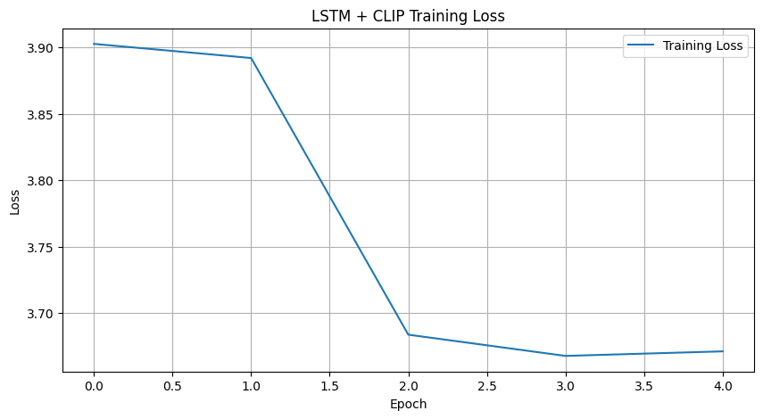

#### LSTM + CLIP Metric Score

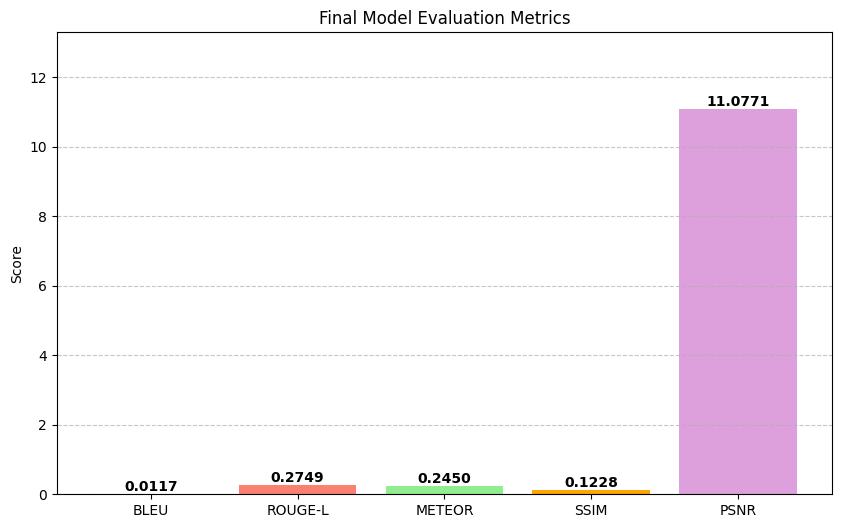

#### Example 
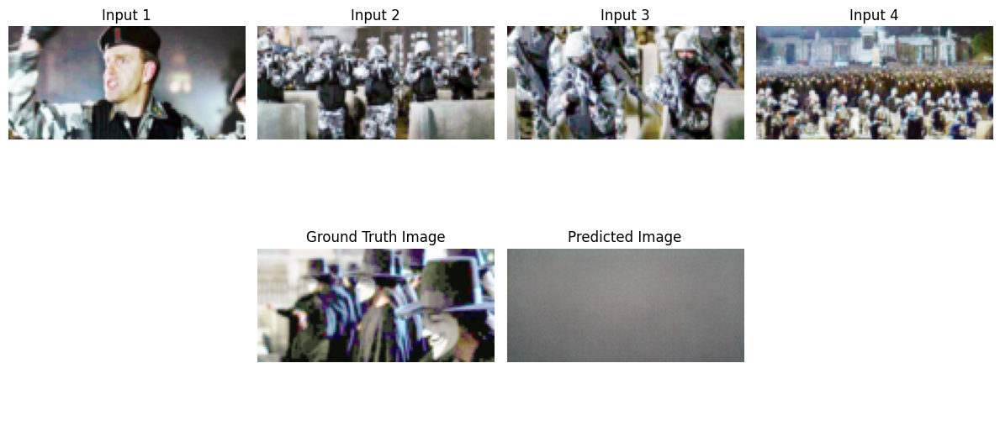

Ground Truth:
 the confrontation continued as anon leader stood among the soldiers. the air was thick with tension, and they tried to decipher the meaning behind the masked figure. anon leader spoke again, “ we are not your enemies. we are the voice of the people. ” the soldiers remained silent, unsure of how to respond.

Prediction:
 in room was to he air of, in the tension, the room was a with a, and the was to the beher the tension. the tension atmosphere. air was,,, and he need to was mind, need to weight was the tension, room ' a, and of the to the. in lighting lighting lighting lighting lighting lightinglllllllllllllllllllllrkedrkedrkedrkedrkedrkedrkedrkedrkedrkedrkedrkedrkedrkedrkedrkedrkedrkedrkedrkedrkedrkedrkedrked


Ground Truth:
 back outside, sarah addressed tom with a sense of urgency. " we need to find her, " she insisted. tom nodded in agreement, his mind racing with possibilities. the potted plant stood as a silent witness to the tension between her and him. the indoor setting felt like a cage, trapping them in their fear.

Prediction:
 in in, the, the, the silent of unease. the we need to the a, but he had,,, the, and mind racing with the. roomted plant, near he man witness to the tension. him. the. room room was a a sense, and him. the shoulders. on lighting lighting lighting lighting lighting lightinglllllllllllllllllrkedrkedrkedrkedrkedrkedrkedrkedrkedrkedrkedrkedrkedrkedrkedrkedrkedrkedrkedrkedrkedrkedrkedrkedrkedrkedrkedrkedrked

#### Attention Heatmap

This is the average attention heatmap over 3 examples

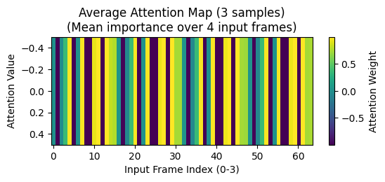

### Summary of LSTM + CLIP Model Evaluation

The only modifications were made to visual encoder and the loss rebalacing which is now it differs from the baseline.
This model achieved SSIM score of 0.1128 and PSNR score of 11.0771, while the image loss was 0.0790. The LSTM + CLIP model reduces image loss from 0.2413 to 0.0790 which is roughly a 67% reduction in reconstruction error.
This is the strongest indication that the CLIP is helping the decoder reconstruct images more accurately although it is hard to tell from the image.
The PSNR slightly increased from 11.0754 to 11.0771 which suggests that it is slightly cleaner and has less (marginally) reconstruction noise.
The SSIM slightly decreases and suggest that the CLIP compared to the baseline may reconstruct the structural details slightly worse and reasons could be the decoder may not have enough capacity to fully reconstruct CLIP features or the CLIP embeddings are less detail preserving that it should be.
An improvement for the visual encoder may require a higher laent dimension, stronger decoder, skip connection or longer training to recover fine structural details and produce more than blurs.
The results says indicates that the CLIP is outperforming the CNN baseline even when they have the same parameters and that suggests a further improvement on the visual autoencoder with CLIP is in the right direction.


# RoBERTa + CNN Model

In this experiment, the original LSTM-based text encoder used in the baseline model is replaced with a pretrained RoBERTa encoder. The primary goal of this modification is to improve the quality of the learned language representations and enhance text reconstruction performance, particularly in terms of BLEU, ROUGE, and METEOR metrics.

RoBERTa is a transformer-based model pretrained on a large corpus of English text using self-supervised learning. This means it was trained on raw text data without manual labeling, allowing it to leverage massive publicly available datasets. During pretraining, the model automatically generates learning objectives from the text itself.

The baseline LSTM encoder learns sequentially from left to right. It attempts to compress the entire sentence into its final hidden state, after which the decoder reconstructs or generates sequences from that compressed representation.

The purpose of the RoBERTa encoder in this architecture is to:
- extract contextual language features,
- compress them into a latent representation,
- and convert them into an LSTM-compatible hidden state.

Although the encoder is transformer-based, the decoder remains an LSTM, allowing for a more direct comparison against the baseline architecture.

In the modified architecture, the pipeline becomes:

```text
RoBERTa Encoder → Attention Pooling → Projection Head → LSTM Decoder
```

The RoBERTa encoder is initially frozen because of its large number of parameters, which can otherwise make training unstable or lead to overfitting. Only the later layers (last 4 layers) are unfrozen, since fine-tuning the final layers helps RoBERTa adapt to the downstream task while still retaining its pretrained general language knowledge.

The RoBERTa encoder then performs learned attention pooling to determine which tokens are most important within a sentence. The attention mask prevents padding tokens from influencing the attention mechanism, and weighted attention is used to create a summarized sequence representation.

The model also incorporates CLS token fusion, where the first token representation acts as a global sentence-level summary. In addition, layer normalization is applied to stabilize training, while the projection head performs latent compression before passing the representation into the LSTM decoder. The decoder then performs autoregressive sequence generation similarly to the baseline model.

Although the comparison with the baseline architecture is not entirely fair, since the baseline LSTM encoder had already been pretrained independently for 15 epochs, all other hyperparameters and training settings were kept unchanged, including:
- CNN text decoder,
- latent dimension,
- embedding dimension,
- batch size,
- learning rate,
- and number of training epochs.

This experiment therefore isolates the effect of replacing the handcrafted pretrained LSTM encoder with a large-scale pretrained transformer-based language representation model, while also introducing staged decoder training and balanced multimodal loss optimization to improve text reconstruction performance.


### RoBERTa + CNN Model
| Model | Text Loss | Image Loss | BLEU | ROUGE-L | METEOR | SSIM | PSNR | Number of Epochs | Learning Rate | Batch Size | Embedding Dim | Latent Dim | Num Layers |
|---|---:|---:|---:|---:|---:|---:|---:|---:|---:|---:|---:|---:|---:|
| Roberta+CNN | 5.302131553 | 0.078952427 | 0.007175907 | 0.204880145 | 0.154409143 | 0.128350360 | 11.076756277 | 5 | 0.001 | 4 | 16 | 16 | 1 |

## Figure
#### Training loss
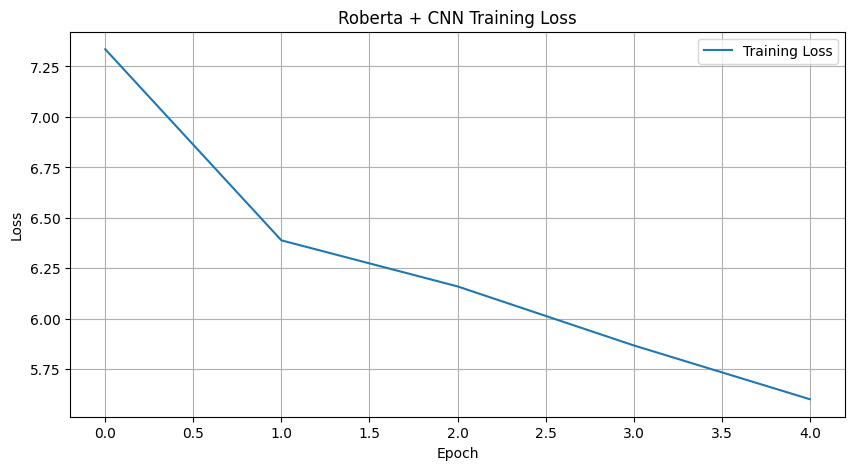

#### Roberta + CNN Evaluation Metrics Score


#### Example
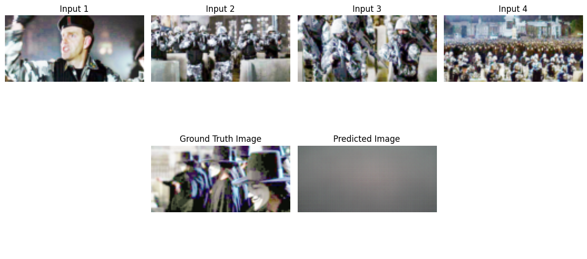
--- TEXT ---
Ground Truth:
 The night was thick with tension as Officer Smith stood in the heart of the Military base. The air carried with it the weight of an impending decision, a decision that would alter the course of history. Officer Smith looked over the shoulder of Soldier John, who stood at attention, his military uniform a symbol of dedication and duty. The Officer thought, “How did it come to this? How did the line between us and them become so blurred?” As he glanced at Soldier John, he sighed, knowing he needed to make a choice, one that could either save or condemn many

Prediction:
 In dimly the with the, he,,, the weight of the weight,, The the,, a, weight of the mind,. his sense,, weight the weight of the. The,,, the weight, the a, a,, the. a mind,, sense of the, the. The the,, a,,, he,, the, The a he weight of,, the,,, the The,, the,, the a, a,, a., the the the sense, his, with a the, the,,

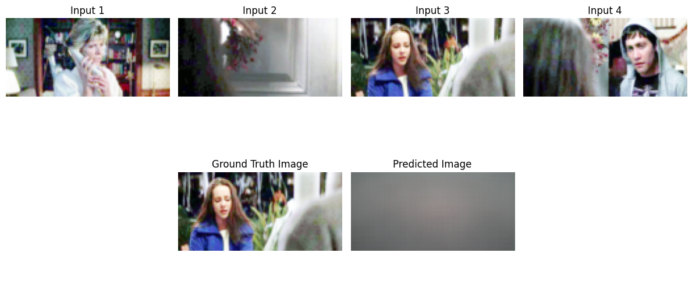

--- TEXT ---
Ground Truth:
 In a dimly lit room, Susan clutched the cell phone tightly, her voice trembling over the line. She whispered anxiously, "Tom, something's wrong. I can't explain it, but I feel like we're running out of time." The indoor setting seemed to close in around her, amplifying the sense of urgency in the air.

Prediction:
 In the dimly lit dim, the, mind the weight,,, a mind the, the weight of The,,,, hisWe, his, mind. The the,,., a the, the the,,,. the, the the,, to the, the the mind a, the weight of the, the weight, The, a a a a a a a a a a a a a a a a a a a a a a a a a a a a a a a a a a a a a a a a a a a a a a
#### Attention Heatmap
This is the average attention heatmap over 3 examples
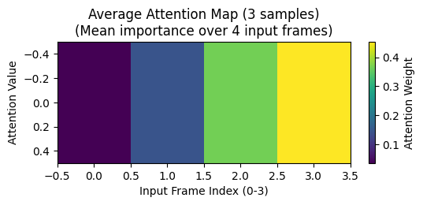

### Summary of The RoBERTa + CNN Metric Evaluation 
The RoBERTa+CNN model reduced image reconstruction loss from 0.2413 to 0.0790 (about 67% lower) and raised SSIM to 0.1284 and PSNR to 11.0768, suggesting the richer RoBERTa embeddings are implicitly helping image quality, even though the CNN encoder stayed the same.  

Text generation, however, got worse: BLEU dropped from 0.0148 to 0.0072 and METEOR from 0.2432 to 0.1544, indicating that the LSTM decoder and small latent space may not yet be strong enough to fully exploit RoBERTa’s richer embeddings.  

Attention heatmaps show the model strongly favors the last frame, and generated text only shows partial phrases and repeated context‑like words (e.g., “weight,” “mind,” “dimly lit”), which hints that the model is starting to capture semantics but still struggles with coherent long sequences. Together, this suggests RoBERTa improves the latent space, but the bottleneck has shifted to the decoder and latent‑space design.

# RoBERTa + CLIP Initial Model

In this experiment, I combined the pretrained RoBERTa text encoder from the RoBERTa+CNN run with the CLIP visual encoder from the LSTM+CLIP model to test how well they work together. This is the first of five RoBERTa+CLIP variants aimed at finding the strongest configuration.

I wanted to see if connecting transformer‑based RoBERTa text features with CLIP image embeddings could improve both text and image reconstruction compared to earlier models. For the first time, I’m putting two independently pretrained encoders into a single shared latent space.

To better match their capacity, I increased the embedding and latent dimensions from 16 to 32, the batch size from 4 to 8, and training from 5 to 10 epochs, while keeping the learning rate and decoder depth the same to focus on representation strength.
#### Modified Architecture Pipeline

```text
Image Sequence ──► CLIP Visual Encoder ──┐
                                         │
Text Input ──► RoBERTa Encoder ──────────┤
                                         ▼
                              Multimodal Fusion
                                         ▼
                               Temporal GRU Encoder
                                         ▼
                                  Attention Layer
                                         ▼
                                 Projection Head
                                         ▼
                              Shared Latent Vector
                               ↙                 ↘
                    Visual Decoder          LSTM Decoder
                           ↓                      ↓
              Predicted Future Frame     Predicted Text Sequence
 ```
This experiment therefore evaluates whether the stronger pretrained language and visual representations can jointly improve multimodal alignment, reconstruction quality, and latent space learning compared to the previous CNN- and LSTM-based configurations.

## RoBERTa + CLIP Model

| Model | Text_Loss | Image_Loss | BLEU | ROUGE-L | METEOR | SSIM | PSNR | Number of Epochs | Learning Rate | Batch Size | Embedding Dim | Latent Dim | Num Layers |
|---|---|---|---|---|---|---|---|---|---|---|---|---|---|
| Roberta+CLIP | 4.509541705 | 0.078986581 | 0.020287719 | 0.282271616 | 0.226246584 | 0.12779492 | 11.07765492 | 10 | 0.001 | 8 | 32 | 32 | 1 |

## Figure
#### Training loss
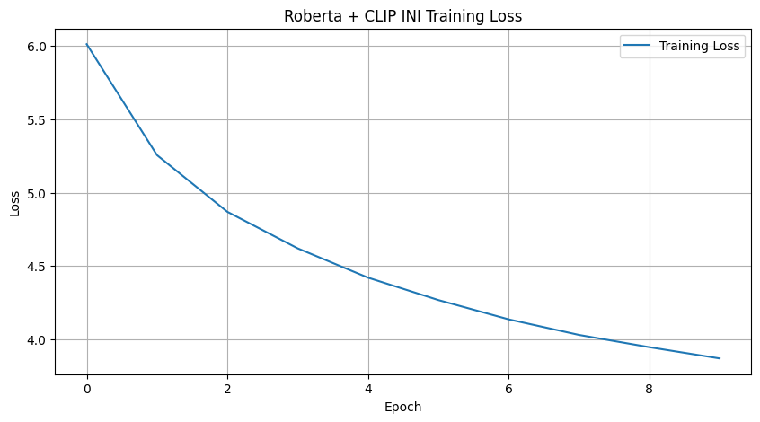

#### Roberta + CLIP Initial Evaluation Metrics Score


#### Example
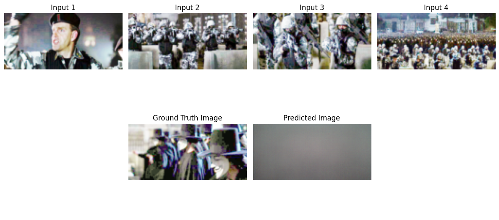
Ground Truth:
 The night was thick with tension as Officer Smith stood in the heart of the Military base. The air carried with it the weight of an impending decision, a decision that would alter the course of history. Officer Smith looked over the shoulder of Soldier John, who stood at attention, his military uniform a symbol of dedication and duty. The Officer thought, “How did it come to this? How did the line between us and them become so blurred?” As he glanced at Soldier John, he sighed, knowing he needed to make a choice, one that could either save or condemn many

Prediction:
 In night was thick with a as the the, near the room of the room of, The air was the a was weight of the andase. his sense that had change the weight of the. The the,, the weight, the., his felt near the, his mind of. sense of the. the, The airered, his andWe did he was. the was The was he air of the the the. the on, The  to he felt at the,, his felt, his that had to the the sense. his that the change be. he to,


Ground Truth:
 In a dimly lit room, Susan clutched the cell phone tightly, her voice trembling over the line. She whispered anxiously, "Tom, something's wrong. I can't explain it, but I feel like we're running out of time." The indoor setting seemed to close in around her, amplifying the sense of urgency in the air.

Prediction:
 In the dimly lit room, a stoodched the room,,, his eyes a. the weight. The had, he, hisWe. his was mind. The felt't shake the was his the felt the a need a on of the, air room, to the in the the. aifying the weight of the. the weight. The the,,,,,,,,,,,,,,,,,,,,,,,,,,,,,,,,,,,,,,,,,,,,,,

#### Attention Heatmap
This is the average attention heatmap over 3 examples

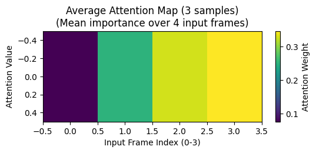

## Summary of The Roberta + CLIP Metric Evaluation

The RoBERTa+CLIP model improved both image and text quality over earlier setups, cutting image reconstruction loss from 0.2413 to 0.0790, keeping SSIM near 0.1278 and PSNR near 11.08, and achieving the best BLEU so far (0.0203). Attention heatmaps now concentrate more on the last two frames, indicating better use of recent context, while generated text remains rough but shows clearer sentence patterns and contextual phrases like “In the dimly lit room,” suggesting the model is starting to learn simple narrative structure.

# RoBERTa + CLIP Final Model 1 

In this stage, the focus shifted from architecture tweaks to systematically tuning training and capacity hyperparameters for the RoBERTa+CLIP framework. Instead of changing the model design, I explored how depth, latent size, training length, and optimization settings affect multimodal learning.

Across runs, I adjusted epochs, learning rate, batch size, embedding/latent dimension, and decoder layers to see whether gains came from bigger models, better optimization, or a more expressive latent space. The set includes the original 10‑epoch setup and a heavier 40‑epoch variant with a smaller learning rate and a much larger latent space, enabling a direct comparison between fast‑training and high‑capacity regimes.


## RoBERTa + CLIP FInal Model 1
| Model | Text_Loss | Image_Loss | BLEU | ROUGE-L | METEOR | SSIM | PSNR | Number of Epochs | Learning Rate | Batch Size | Embedding Dim | Latent Dim | Num Layers |
|---|---|---|---|---|---|---|---|---|---|---|---|---|---|
| Roberta+CLIP FIN | 5.803475022 | 0.080962952 | 8.62E-156 | 0.207269438 | 0.119652985 | 0.09111222 | 10.96309684 | 40 | 2.00E-05 | 32 | 256 | 256 | 1 |

## Figure
#### Training loss
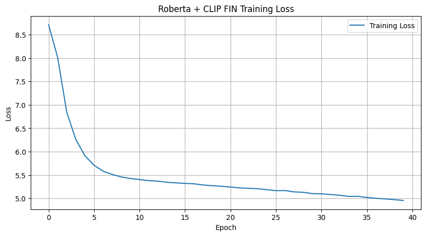

#### RoBERTa + CLIP 1 Evaluation Metrics Score
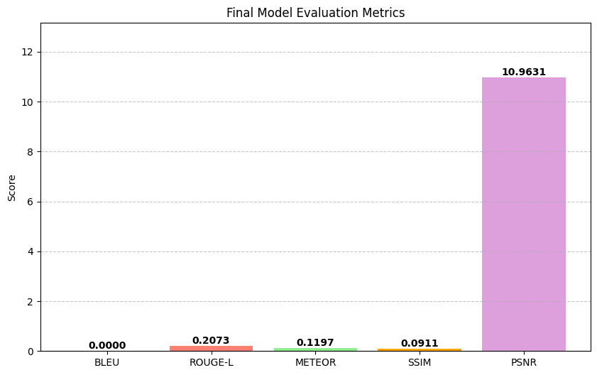

#### Example
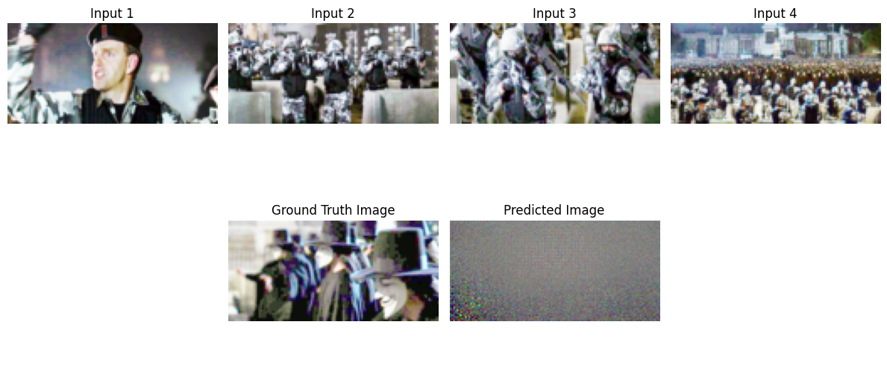
Ground Truth:
 The night was thick with tension as Officer Smith stood in the heart of the Military base. The air carried with it the weight of an impending decision, a decision that would alter the course of history. Officer Smith looked over the shoulder of Soldier John, who stood at attention, his military uniform a symbol of dedication and duty. The Officer thought, “How did it come to this? How did the line between us and them become so blurred?” As he glanced at Soldier John, he sighed, knowing he needed to make a choice, one that could either save or condemn many

Prediction:
 In the the a, a.,,., the., the., the The,,, a,. of the.,. his the, the the,., the. The,, the the., the,, the the, the, his,,,,, the. the, The,,, his the the,.,. the the, the..,,, the.., the,,. the,, the,, the,, his the,, the the the, his, the, the,, the.


Ground Truth:
 In a dimly lit room, Susan clutched the cell phone tightly, her voice trembling over the line. She whispered anxiously, "Tom, something's wrong. I can't explain it, but I feel like we're running out of time." The indoor setting seemed to close in around her, amplifying the sense of urgency in the air.

Prediction:
 In the thely,,, the the, the, the,, the,, the the., The,, the the the,, the the,, The,, the the, the the,, the,, the, the,,,,, the the, the the, his, the. of the. the.. The,,,,,,,,,,,,,,,,,,,,,,,,,,,,,,,,,,,,,,,,,,,,,,,

#### Average Heatmap
This is the average heatmap over 3 examples

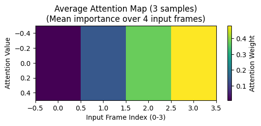

## Summary of RoBERTa + CLIP Final 1 Experiment

In this second Roberta+CLIP experiment, I kept the same architecture but only tuned training hyperparameters to test the impact of higher capacity and longer training. The model performs worse overall: text metrics collapse, with BLEU nearly zero and ROUGE‑L (0.2073) and METEOR (0.1197) dropping sharply, while image quality also degrades (SSIM ≈0.0911, PSNR ≈10.96).

Attention still heavily favors the last frame—more than four times the first frame on average—but the pattern shifts across examples, ranging from strongly front‑skewed to slightly more balanced. Generated outputs stay repetitive and incoherent, suggesting the model never really converged. This setup likely used a too‑low learning rate (2e‑5), so the extra capacity and longer training couldn’t compensate, leading to underfitting instead of improvement.

# RoBERTa + CLIP Final Model 2

After the last experiment underfitted, I adjusted the hyperparameters to give the model a better shot at learning useful multimodal text‑and‑image representations. The poor convergence pointed to a learning rate that was too low, so I increased it here while keeping the architecture otherwise unchanged.

In this stage (RoBERTa+CLIP FIN 2), I raised the learning rate and tuned batch size and latent/embedding dimensions to improve stability and training dynamics. The goal is to see whether better optimization alone can unlock cleaner, more structured image and text outputs compared with the earlier failed configuration, even if images still look a bit blurry.
## RoBERTa + CLIP FInal Model 2
| Model | Text_Loss | Image_Loss | BLEU | ROUGE-L | METEOR | SSIM | PSNR | Number of Epochs | Learning Rate | Batch Size | Embedding Dim | Latent Dim | Num Layers |
|---|---|---|---|---|---|---|---|---|---|---|---|---|---|
| Roberta+CLIP FIN 2 | 4.28471905 | 0.078944218 | 0.032195837 | 0.283404547 | 0.245390736 | 0.12537888 | 11.08315329 | 40 | 0.0001 | 16 | 128 | 128 | 1 |


### Figures
#### Training loss
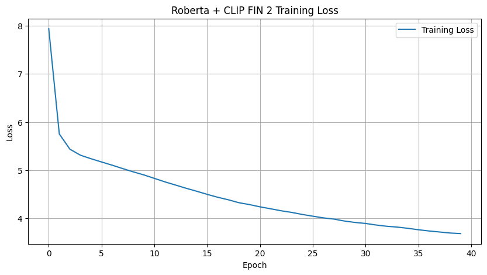

#### RoBERTa + CLIP 2 Evaluation Metrics Score
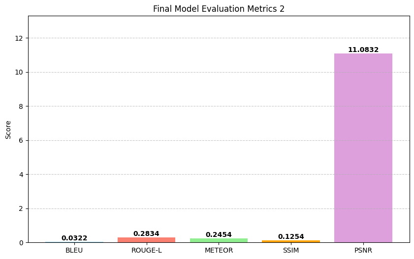

#### Example
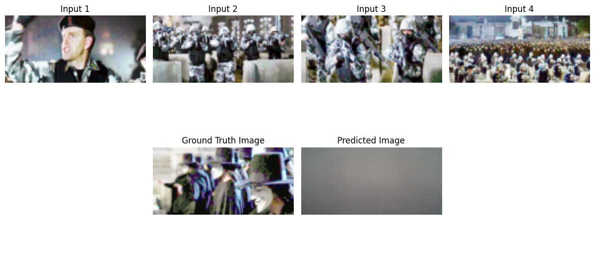
Ground Truth:
 The night was thick with tension as Officer Smith stood in the heart of the Military base. The air carried with it the weight of an impending decision, a decision that would alter the course of history. Officer Smith looked over the shoulder of Soldier John, who stood at attention, his military uniform a symbol of dedication and duty. The Officer thought, “How did it come to this? How did the line between us and them become so blurred?” As he glanced at Soldier John, he sighed, knowing he needed to make a choice, one that could either save or condemn many

Prediction:
 In night was thick with tension as the the stood in the room of a room of. The air was a a was room of the old tension. his silent of the change the tension of the. The The,, the background, the,, his felt in the, his mind expression. mix of the. the. The air of was the  a, the,, the moment, he beginning of the of the. the..  he had at the,, his felt the his that was to the the sense. but that would change the. a..

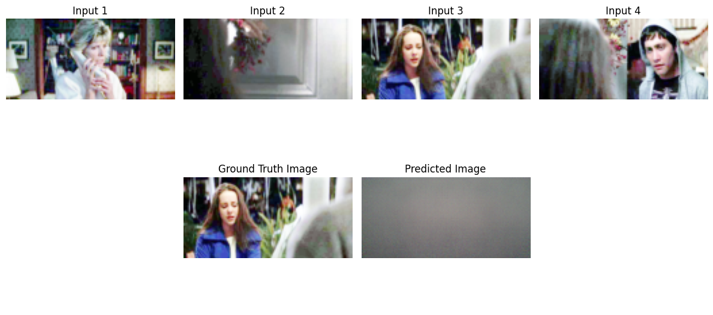

Ground Truth:
 In a dimly lit room, Susan clutched the cell phone tightly, her voice trembling over the line. She whispered anxiously, "Tom, something's wrong. I can't explain it, but I feel like we're running out of time." The indoor setting seemed to close in around her, amplifying the sense of urgency in the air.

Prediction:
 In the dimly lit room, John,ched the room,,, his eyes barely. the room of The had,,, hisWe, his was mind. The,'t shake the, his he he the a. a to of the. air room, to the in the him, hisifying the weight of the. the air. The, the,,,, the the the.......... the the the the the the the the the the the the the the the the the the the the the the the the the the the the

#### Average Heatmap
This is the average heatmap over 3 examples
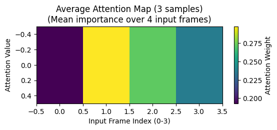

## Summary of RoBERTa + CLIP Final 2 Experiment

The RoBERTa + CLIP FIN 2 experiment is currently the best-performing configuration so far after adjusting key hyperparameters such as learning rate, batch size, and latent dimension to improve training stability and convergence. Compared to earlier failed runs, this setup shows clearer improvements in both text and image metrics, with BLEU (0.0322), ROUGE-L (0.2834), and METEOR (0.2454) being the strongest achieved so far.

Image reconstruction remains stable with SSIM (0.1254) and PSNR (11.0832), consistent with previous CLIP-based models. The attention map also shows a more balanced distribution across inputs, with input 2 (~0.30) receiving the highest weight, followed closely by input 3 (approx. 0.26), input 4 (approx. 0.24), and input 1 (approx. 0.20), indicating less bias toward later frames.

However, outputs are still largely incoherent despite slight structural improvements in generated text. While this model is the strongest so far, the results suggest that parameter tuning alone is insufficient, and meaningful further gains will likely require architectural changes to both the RoBERTa and CLIP components.


# RoBERTa + CLIP Final Model 3

After the previous experiments showed that performance improvements could not be achieved through hyperparameter tuning alone, this stage focuses on architectural refinements to both the RoBERTa and CLIP encoders. The goal is to improve how multimodal features are represented in the shared latent space, rather than only adjusting training settings.

On the **RoBERTa text autoencoder**, more transformer layers were unfrozen (from 4 → 6) to allow deeper task-specific adaptation. The LSTM hidden initialization was also improved by explicitly supporting multi-layer decoding through repeated latent states, which improves gradient flow and stabilizes sequence generation. In addition, a small MLP head was added to the decoder output along with weight tying between embedding and output layers, improving semantic consistency and reducing prediction noise.
**[Roberta_autoencoder](src/Roberta_autoencoder.py)
from 
```python
hidden = latent.unsqueeze(0)

```
to the modified
```python
hidden = latent.unsqueeze(0).repeat(2, 1, 1)
```
This allowed us to increase the number of layers in the LSTM decoder to 2.

Next we look at the Encoder output change
from
```python
return None, hidden, cell
```
to 
```python
return latent, hidden, cell
```
This allowed me to preserve the latent embedding explicitly

Next the biggest change was the decoder improvement
I added this
```python
self.head = nn.Sequential(
    nn.Linear(hidden_dim, embedding_dim),
    nn.GELU(),
    nn.LayerNorm(embedding_dim)
)
```
This was added to smoothing the LSTM outputs before classification, reduce noisy logits and improve word-level stability

Lastly, I added weight tying
```python
self.out.weight = self.embedding.weight
```
Previously we had our model repeating words like "the" a lot and some other words so now this improves semantic consistency, better generalization and sets Embedding space = output prediction space


On the **CLIP visual autoencoder**, the main change is a stronger projection head. Instead of a single linear mapping, CLIP features are passed through a deeper MLP (Linear → LayerNorm → GELU → Dropout → Linear), allowing the visual embeddings to be reshaped into a more expressive latent manifold. This is combined with partial unfreezing of CLIP vision layers, enabling mild dataset-specific adaptation while still preserving pretrained visual knowledge.

Firstly we have the encoder difference of projection head complexity
from
```python
self.projection = nn.Linear(hidden_dim, latent_dim)
```
to 
```python
self.projection = nn.Sequential(
    nn.Linear(hidden_dim, 512),
    nn.LayerNorm(512),
    nn.GELU(),
    nn.Dropout(dropout),
    nn.Linear(512, latent_dim)
)
```
We changed from single linear layer to Deep MLP, added LayerNorm, Gelu and Dropout and these transforms the CLIP features from fixed embedding space to learnable latent manifold, reduces linear bottleneck collapse and improve nonlinear separability of visual concepts

Next we unfreeze layers
```python
unfreeze_layers=2
for layer in self.clip.vision_model.encoder.layers[-unfreeze_layers:]:
    
```
This was done allow partial CLIP fine-tuning

Also we modified the autoencoder 
from
```python
self.encoder = CLIPEncoderWrapper(latent_dim, output_w, output_h)
```
to 
```python
self.encoder = CLIPEncoderWrapper(latent_dim)
```
This ignores the spatial config arguments.

Importantly, the decoder architecture remains unchanged, meaning all performance changes are driven by improvements in the **encoder and latent representation quality**, not decoding capacity.

Overall, this experiment represents a shift from tuning training parameters to improving representation learning, with both encoders redesigned to produce a richer, more stable shared latent space for multimodal sequence prediction.


## RoBERTa + CLIP 3 Model
| Model | Text_Loss | Image_Loss | BLEU | ROUGE-L | METEOR | SSIM | PSNR | Number of Epochs | Learning Rate | Batch Size | Embedding Dim | Latent Dim | Num Layers |
|---|---|---|---|---|---|---|---|---|---|---|---|---|---|
| Roberta+CLIP FIN 3 | 3.916189098 | 0.078912555 | 0.081606383 | 0.374881738 | 0.333105029 | 0.12828614 | 11.08332996 | 50 | 0.00025 | 16 | 128 | 128 | 2 |


### Figures
#### Training loss
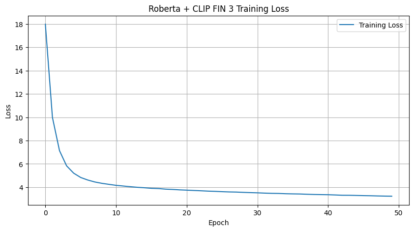

#### RoBERTa + CLIP 3 Evaluation Metrics Score


#### Example

Ground Truth:
 The night was thick with tension as Officer Smith stood in the heart of the Military base. The air carried with it the weight of an impending decision, a decision that would alter the course of history. Officer Smith looked over the shoulder of Soldier John, who stood at attention, his military uniform a symbol of dedication and duty. The Officer thought, “How did it come to this? How did the line between us and them become so blurred?” As he glanced at Soldier John, he sighed, knowing he needed to make a choice, one that could either save or condemn many

Prediction:
 In night was thick with tension as John Smith stood at the dim of the bustling.. The room was the a was events of the impending decision pressing and silent that could change the course of his. Smith felt at him air, the,, who stood near the, his mind a and stark of the. the. The air and about " We, little come to this moment The she she events beyond them them the...  she she took at the,, his felt, his that was to make. journey. but that he change make or the..


Ground Truth:
 In a dimly lit room, Susan clutched the cell phone tightly, her voice trembling over the line. She whispered anxiously, "Tom, something's wrong. I can't explain it, but I feel like we're running out of time." The indoor setting seemed to close in around her, amplifying the sense of urgency in the air.

Prediction:
 In the dimly lit room with John stoodched a cell phone tightly, his eyes barely with the tension. The felt,iously, herWhat, the need not?" have't afford this?" a the was it a focus and out of a. weight setting with to whisper in, him, aifying the tension of une. the air.ly the the............................................

#### Average Heatmap
This is the average heatmap over 3 examples
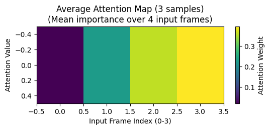

### Summary of RoBERTa + CLIP Model 3 Evaluation Metrics

The RoBERTa + CLIP FIN 3 experiment achieved the best overall performance so far, particularly in text generation quality. The model produced the strongest Text Loss (3.92), BLEU (0.0816), ROUGE-L (0.3749), and METEOR (0.3331) scores across all experiments while maintaining stable image reconstruction performance.

The improvements are largely attributed to the architectural refinements introduced in both the RoBERTa and CLIP components. The added MLP projection head and weight tying improved semantic consistency and reduced noisy token predictions, resulting in more coherent and structured text generation. Partial fine-tuning of additional RoBERTa and CLIP layers also improved latent representation quality and multimodal alignment.

The generated outputs are still imperfect, but they are significantly more coherent than earlier experiments and contain clearer sentence structure and contextual flow instead of repetitive token collapse.

The attention heatmap also shows a strong temporal focus pattern, where attention decreases from input 4 → input 1. Input 4 receives the highest attention (approx. 0.4), while input 1 receives very little attention (below 0.1), suggesting the model relies heavily on the most recent frames for prediction.


# RoBERTa + CLIP Final Experiment (Pretrained RoBERTa + CLIP autoencoders)

After significantly improving the text encoder in previous experiments, the focus shifted toward the weak performance of the visual autoencoder. To improve representation quality before sequence prediction, both the text and visual autoencoders were pretrained independently before being integrated into the main sequence predictor. The text autoencoder was pretrained for 86 epochs, while the visual autoencoder was pretrained for 25 epochs.

The upgraded visual encoder was also tested on a single-image reconstruction task and was able to reconstruct an image to roughly 95% similarity within 1400 training steps, confirming that the architecture was capable of learning meaningful image reconstruction beyond blurred outputs.

Unlike earlier CLIP models that relied mainly on a single pooled embedding, the new architecture introduces hierarchical spatial feature extraction using multiple CLIP hidden states combined with skip connections, residual decoding blocks, and progressive upsampling. The CLIP backbone was also upgraded from Patch32 to Patch16, increasing spatial resolution from 7×7 to 14×14 feature maps and improving spatial detail preservation.

Perceptual loss using VGG16 features was additionally introduced to improve reconstruction sharpness and semantic consistency beyond standard pixel-level losses.

After pretraining both autoencoders, the pretrained components were integrated into the sequence predictor using the following parameters:

- Epochs: 17  
- Learning Rate: 0.0001  
- Batch Size: 16  
- Embedding Dimension: 128  
- Latent Dimension: 128  
- Number of Layers: 2  

**[Visual Autoencoder](src/CLIP_visual_encoder.py)** - Final Modification of the CLIP autoencoder


#### Single Image Test
**[src/single_image_test.py]**

#### SIngle Image Test
This tests whether the model has enough capacity to perfectly reconstruct one image.
If the model cannot overfit one image, it will not reconstruct a full dataset properly.
The below shows how the single image was able to be created to 95% accuracy by step_1400 showing that the model is capable of reconstruction when compared step_0 to step_1400
#### Single Image Training Loss
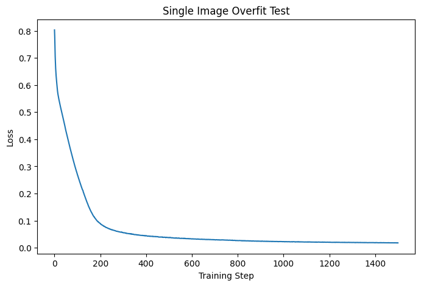

#### Single Image Step Progress Between Step 0 vs Step 1400
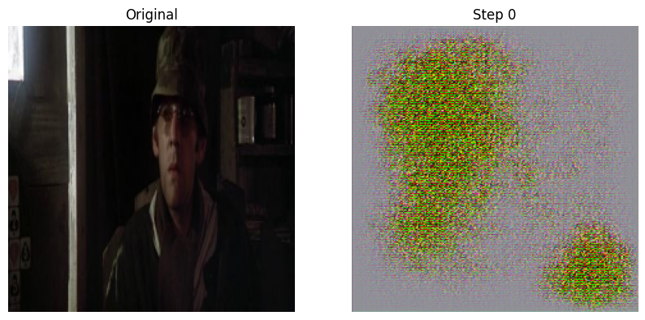
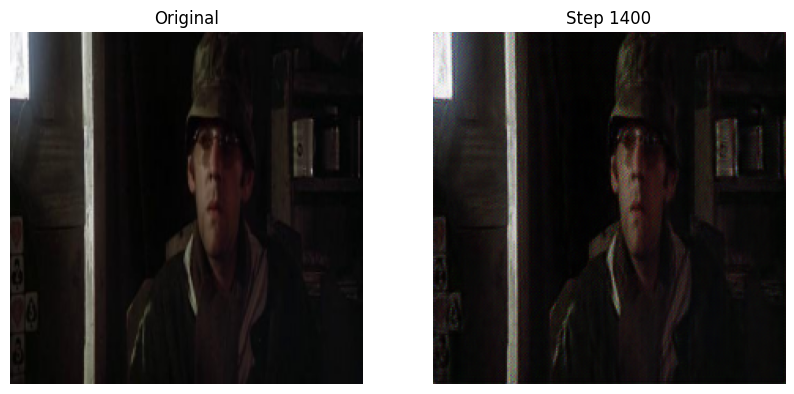

## RoBERTa + CLIP FINAL Model
| Model              | Text_Loss | Image_Loss | BLEU | ROUGE-L | METEOR | SSIM | PSNR | Number of Epochs | Learning Rate | Batch Size | Embedding Dim | Latent Dim | Num Layers |
|--------------------|---|---|---|---|---|---|---|---|---|---|---|---|---|
| Roberta+CLIP FINAL | 3.085878801 | 0.079319471 | 0.149424893 | 0.409114987 | 0.462147619 | 0.23048213 | 11.0754061 | 17 (86 pretain Roberta, 25 pretrain clip) | 0.0001 | 16 | 128 | 128 | 2 |

### Figures
#### Training loss
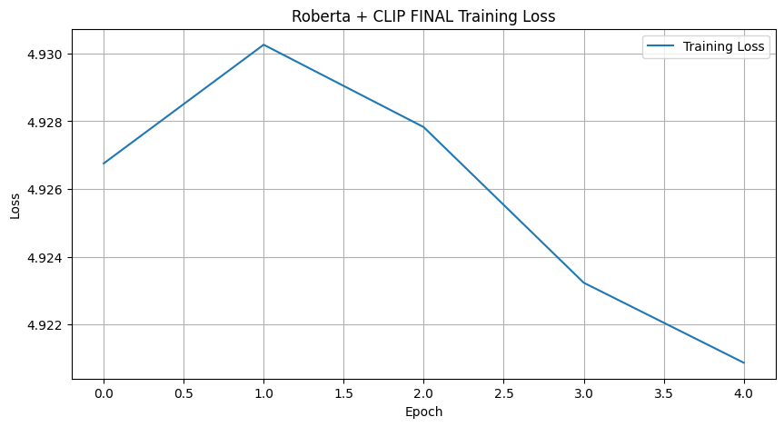

#### RoBERTa + CLIP Final Evaluation Metrics Score


#### Example
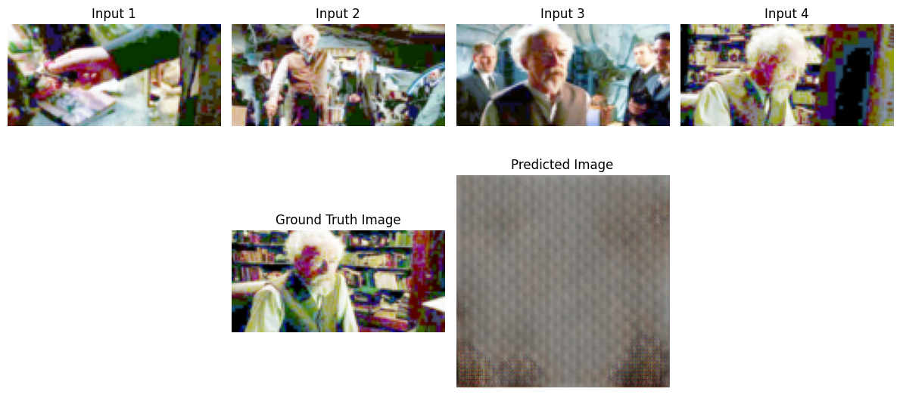
Ground Truth:
 The scene continued in the library, where William remained seated in a chair. His gaze shifted from the books on the shelf to the A dark, shadowy area in the background. The A book, A book, and A book seemed to call out to him, their secrets waiting to be uncovered. William felt a sense of urgency as he realized that time was running out. The suspense of the unfolding drama reached a boiling point as William decided to take action. With a sense of determination, he reached for one of the books on the shelf, ready to unlock the mysteries that lay within. [

Prediction:
 The tension shifted to the room, the the stood focused, the different, The eyes was, the window, the table, the scene room and the the, the background. The wall wall on and man, and the man, to be the to the, and presence that to be.. [, a sense of urgency, he realized that the was running out. The tension was the room drama was its boiling point, the and to take action. The a deep of urgency, he couldn out the, the situation, the other. a to face the unknown. lay ahead. TheC

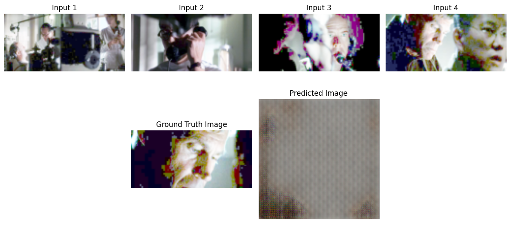
Ground Truth:
 Jack stood alone in the room, the wall behind him feeling like a barrier between him and the outside world. The wall to his right seemed to mock him, reminding him of the isolation he felt. Jack took a deep breath, trying to gather his thoughts. He knew that he had to find a way out of this mess. [COT] ### Characters ### Objects ### Setting

Prediction:
 The, in, the room, the tension and her seemed like a prison. him and the truth world. The tension behind the tie was to close him, a him of the challenges he felt. [ felt a deep breath, steel to calm his thoughts. The knew that the had to find a way to, this situation, [COT] ### Characters ### Objects ### Setting over over over.....,,,,,,,,,,,,,,,,,,,,,,,,,,,,,,,,,

##### Attention Heatmap
This is the attention heatmap of the first 3 examples
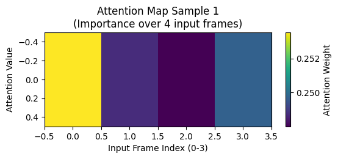


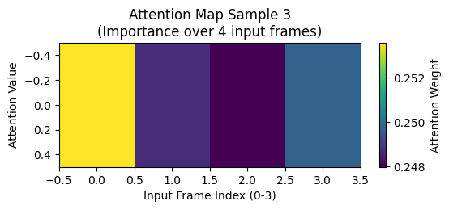

Average Attention Heatmap
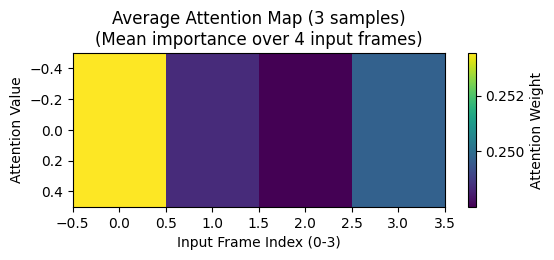
#### Attention Weight Table Over 10 Examples
| example |  input 1 |  input 2 |  input 3 |  input 4 |
|---:|---------:|---------:|---------:|---------:|
| 0 | 0.251364 | 0.248798 | 0.248952 | 0.250885 |
| 1 | 0.251334 | 0.248800 | 0.248982 | 0.250884 |
| 2 | 0.251398 | 0.248773 | 0.248902 | 0.250928 |
| 3 | 0.251276 | 0.248735 | 0.249109 | 0.250881 |
| 4 | 0.251374 | 0.248793 | 0.248970 | 0.250863 |
| 5 | 0.251338 | 0.248803 | 0.248941 | 0.250917 |
| 6 | 0.251263 | 0.248894 | 0.248974 | 0.250869 |
| 7 | 0.251372 | 0.248803 | 0.248930 | 0.250895 |
| 8 | 0.251387 | 0.248746 | 0.248947 | 0.250921 |
| 9 | 0.251342 | 0.248731 | 0.249039 | 0.250888 |
#### Reconstruction Error
Here the model compares its generated image vs actual image and evaluates the difference in both
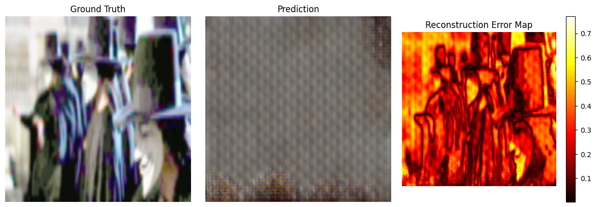
Example 2
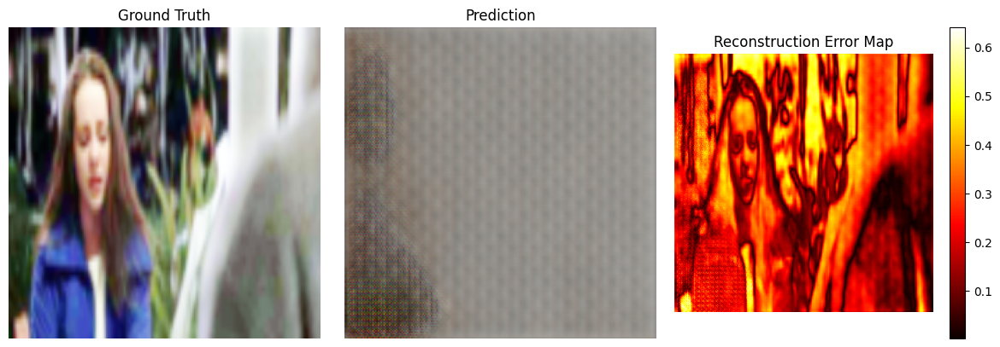

#### CLIP Vision Transformer Attention Heatmap
This function visualizes the attention from a chosen CLIP Vision Transformer layer by extracting the CLS token’s attention to image patches, reshaping it into a spatial heatmap and overlaying it on the original image. It can show either the average attention across heads or specific attention head.

Layer: 0
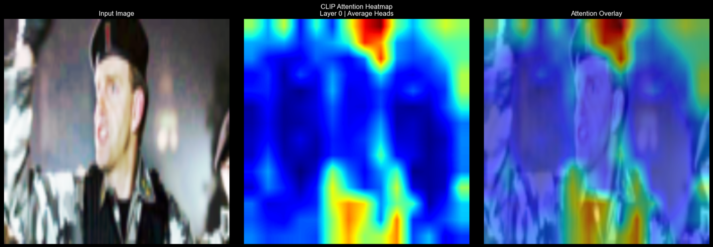

Layer: 11
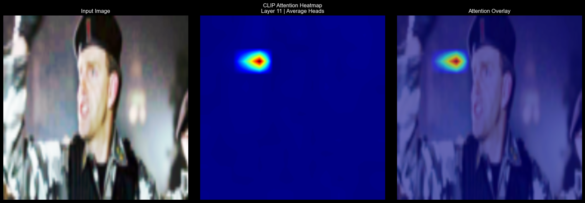

This CLIP heatmap was inspired from https://github.com/SeitaroShinagawa/CLIP-visualization
#### Cross Modal Alignment
This plot tells which image-text pairs are closest in the learned shared embedding space. 
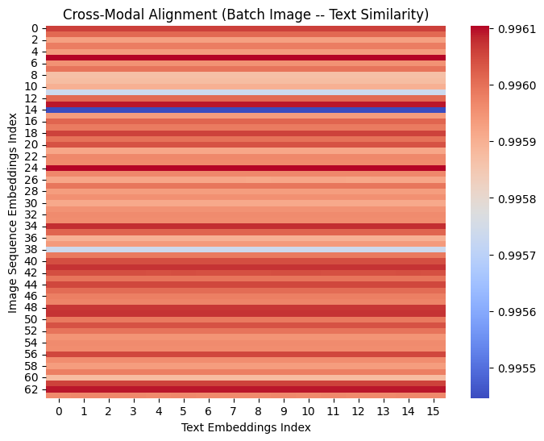

## FINAL TABLE OF EXPERIMENTS
| Model | Text_Loss | Image_Loss | BLEU | ROUGE-L | METEOR | SSIM | PSNR | Number of Epochs | Learning Rate | Batch Size | Embedding Dim | Latent Dim | Num Layers |
|---|---:|---:|---:|---:|---:|---:|---:|---:|---:|---:|---:|---:|---:|
| Baseline | 4.101497128 | 0.241354336 | 0.014808649 |  | 0.243240993 | 0.127940476 | 11.07541324 | 5 | 0.001 | 4 | 16 | 16 | 1 |
| LSTM+CLIP | 4.173895611 | 0.078963423 | 0.011708803 | 0.274862192 | 0.244985779 | 0.12276778 | 11.07707989 | 5 | 0.001 | 4 | 16 | 16 | 1 |
| Roberta+CNN | 5.302131553 | 0.078952427 | 0.007175907 | 0.204880145 | 0.154409143 | 0.12835036 | 11.07675628 | 5 | 0.001 | 4 | 16 | 16 | 1 |
| Roberta+CLIP | 4.509541705 | 0.078986581 | 0.020287719 | 0.282271616 | 0.226246584 | 0.12779492 | 11.07765492 | 10 | 0.001 | 8 | 32 | 32 | 1 |
| Roberta+CLIP FIN | 5.803475022 | 0.080962952 | 8.62E-156 | 0.207269438 | 0.119652985 | 0.09111222 | 10.96309684 | 40 | 2.00E-05 | 32 | 256 | 256 | 1 |
| Roberta+CLIP FIN 2 | 4.28471905 | 0.078944218 | 0.032195837 | 0.283404547 | 0.245390736 | 0.12537888 | 11.08315329 | 40 | 0.0001 | 16 | 128 | 128 | 1 |
| Roberta+CLIP FIN 3 | 3.916189098 | 0.078912555 | 0.081606383 | 0.374881738 | 0.333105029 | 0.12828614 | 11.08332996 | 50 | 0.00025 | 16 | 128 | 128 | 2 |
| Roberta+CLIP FINAL | 3.085878801 | 0.079319471 | 0.149424893 | 0.409114987 | 0.462147619 | 0.23048213 | 11.0754061 | 5 | 0.0001 | 16 | 128 | 128 | 2 |


# Final Experiment Summary

The final experiment achieved the best overall performance across all models, with major improvements in both text generation and image reconstruction quality. The RoBERTa + CLIP architecture achieved a BLEU score of **0.1494**, ROUGE-L of **0.4091**, METEOR of **0.4621**, and improved SSIM to **0.2305**.

The upgraded CLIP Patch16 visual encoder significantly improved spatial understanding by preserving multi-scale feature maps from multiple Vision Transformer layers. Combined with residual decoding blocks, skip connections, perceptual loss, and progressive upsampling, the model produced more structured and spatially consistent image reconstructions compared to earlier experiments.

Text generation also became substantially more coherent, with stronger scene structure, emotional tone, and semantic consistency. Attention visualizations showed more balanced temporal weighting across all four input frames, indicating improved temporal understanding and reduced frame neglect compared to earlier models.

Single-image reconstruction experiments further demonstrated that the visual autoencoder itself is capable of high-quality reconstruction, achieving approximately 95% reconstruction accuracy on simplified tasks. This suggests the current bottleneck is no longer the encoders, but rather the sequence prediction and multimodal fusion components.

Cross-modal alignment analysis showed that the shared latent space remains partially collapsed, with text embeddings still dominating image representations despite multimodal loss rebalancing. Future improvements will focus on transformer-based decoders, stronger cross-attention mechanisms, and diffusion-style image generation methods to improve multimodal alignment and image sharpness.


